---
## Author
author:
  name: Мальянц Виктория Кареновна
  degrees: DSc
  orcid: 0000-0002-0877-7063
  email: 1132246740@rudn.ru
  affiliation:
    - name: Российский университет дружбы народов
      country: Российская Федерация
      postal-code: 117198
      city: Москва
      address: ул. Миклухо-Маклая, д. 6
## Title
title: Лабораторная работа № 1
subtitle: Установка и конфигурация операционной системы на виртуальную машину
license: CC BY
date: today
date-format: "2026-15-02" 
---

# Цель работы

- Целью данной работы является приобретение практических навыков установки операционной системы на виртуальную машину, настройки минимально необходимых для дальнейшей работы сервисов.

# Задание

- Установка Rocky
- Выполнение домашнего задания

# Выполнение лабораторной работы
## Установка Rocky

- Скачала образ диска (рис. 1).

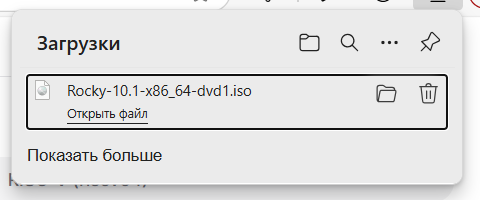{width=70%}

## Установка Rocky

 - Начала создавать новую виртуальную машину, назвала ее vkmaljyanc и добавила образ диска (рис.2).

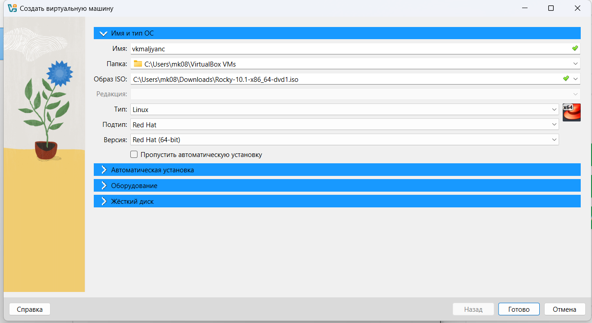{width=70%}

## Установка Rocky

- Продолжила настройку виртуальной машины (рис. 3).

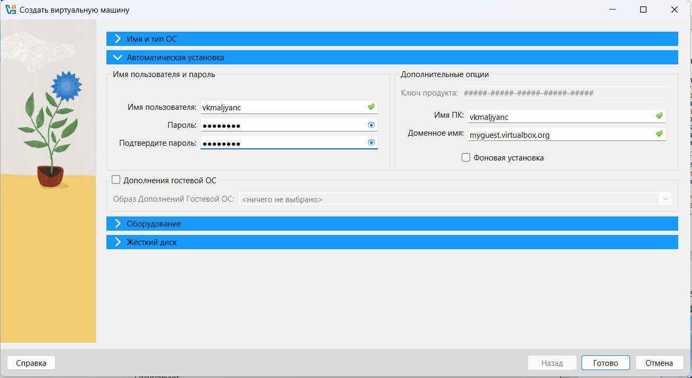{width=70%}

## Установка Rocky

- Установила основную память на 2048 МБ  (рис. 4).

{width=70%}

## Установка Rocky

- Создала новый виртуальный жесткий диск (рис. 5).

{width=70%}

## Установка Rocky

- Выбрала язык (рис. 6).

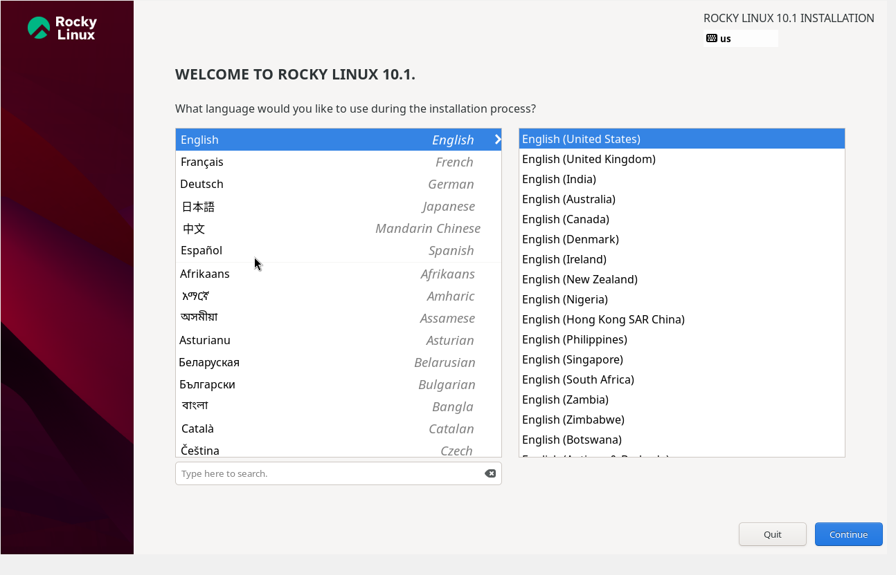{width=70%}

## Установка Rocky

- Перешла к установке Rocky Linux (рис. 7).

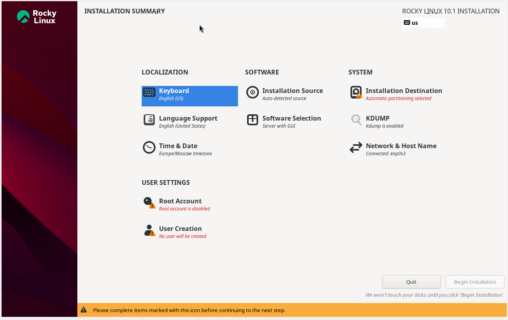{#width=70%}

## Установка Rocky

- Настроила клавиатуру (рис. 8).

{width=70%}

## Установка Rocky

- Настроила часовой пояс (рис. 9).

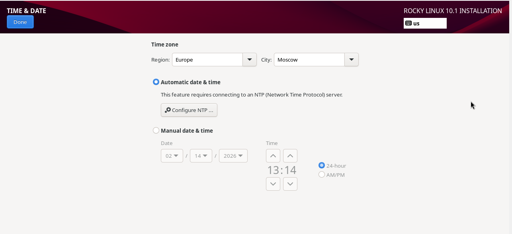{width=70%}

## Установка Rocky

- Выбрала параметры Server with GUI и Development Tools (рис. 10).

{width=70%}

## Установка Rocky

- Отключила kdump (рис. 11).

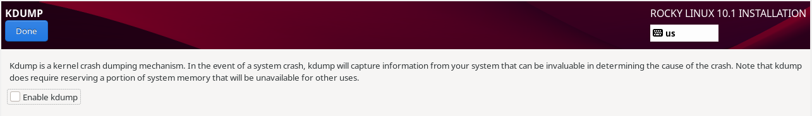{width=70%}

## Установка Rocky

- Создала пользователя (рис. 12).

{width=70%}

## Установка Rocky

- Установка завершена, перезагружаю виртуальную машину (рис. 13).

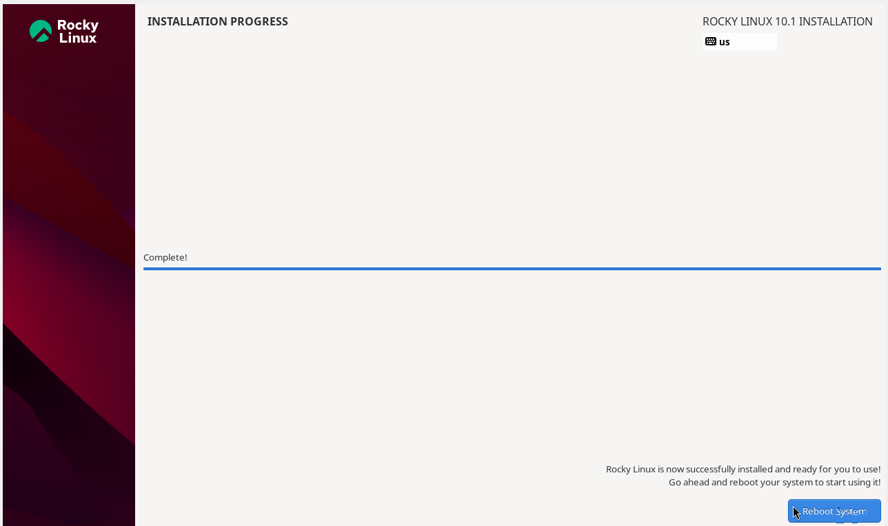{width=70%}

## Установка Rocky

- Вхожу в аккаунт (рис. 14).

{width=70%}

## Установка Rocky

- Задаю имя хоста (рис. 15).

{width=70%}

## Установка Rocky

- Добавила VBoxGuestAdditions.iso (рис. 16).

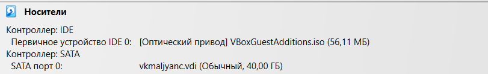{width=70%}

## Выполнение домашнего задания

- Выполняю команду dmesg (рис. 17).

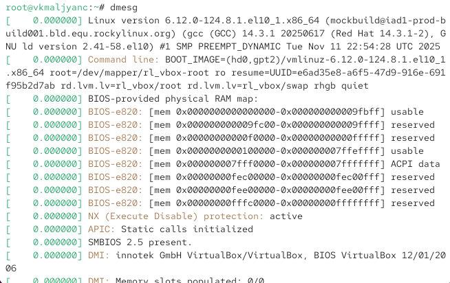{width=70%}

## Выполнение домашнего задания

- Выполняю команду dmesg | less (рис. 18).

{width=70%}

## Выполнение домашнего задания

- Получаю информацию о версии ядра Linux (рис. 19).

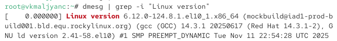{width=70%}

## Выполнение домашнего задания

- Получаю информацию о частоте процессора (рис. 20).

{width=70%}

## Выполнение домашнего задания

- Получаю информацию о модели процессора (рис. 21).

{width=70%}

## Выполнение домашнего задания

- Получаю информацию об объеме доступной оперативной памяти (рис. 22).

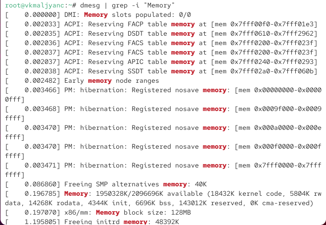{width=70%}

## Выполнение домашнего задания

- Получаю информацию о типе обнаруженного гипервизора (рис. 023).

{width=70%}

-  Получаю информацию о типе файловой системы корневого раздела (рис. 24).

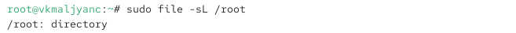{width=70%}

## Выполнение домашнего задания

- Получаю информацию о последовательности монтирования файловых систем (рис. 25).

{width=70%} 

# Выводы

- Я приобрела практические навыки установки операционной системы на виртуальную машину, настройки минимально необходимых для дальнейшей работы сервисов.

# Спасибо за внимание
