---
## Author
author:
  name: Мальянц Виктория Кареновна
  degrees: DSc
  orcid: 0000-0002-0877-7063
  email: 1132246740@rudn.ru
  affiliation:
    - name: Российский университет дружбы народов
      country: Российская Федерация
      postal-code: 117198
      city: Москва
      address: ул. Миклухо-Маклая, д. 6

## Title
title: "Лабораторная работа № 1"
subtitle: "Установка и конфигурация операционной системы на виртуальную машину"
license: "CC BY"
---

# Цель работы

Целью данной работы является приобретение практических навыков установки операционной системы на виртуальную машину, настройки минимально необходимых для дальнейшей работы сервисов.

# Задание

1) Установка Rocky
2) Выполнение домашнего задания
3) Ответы на контрольные вопросы

# Выполнение лабораторной работы
## Установка Rocky
Скачала образ диска ([рис. @fig-001]).

{#fig-001 width=70%}

 Начала создавать новую виртуальную машину, назвала ее vkmaljyanc и добавила образ диска ([рис. @fig-002]).

{#fig-002 width=70%}

Продолжила настройку виртуальной машины ([рис. @fig-003]).

{#fig-003 width=70%}

Установила основную память на 2048 МБ  ([рис. @fig-004]).

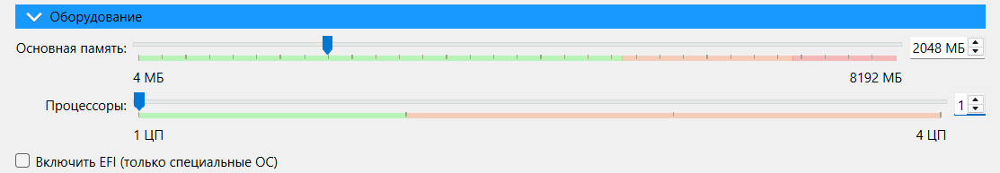{#fig-004 width=70%}

Создала новый виртуальный жесткий диск ([рис. @fig-005]).

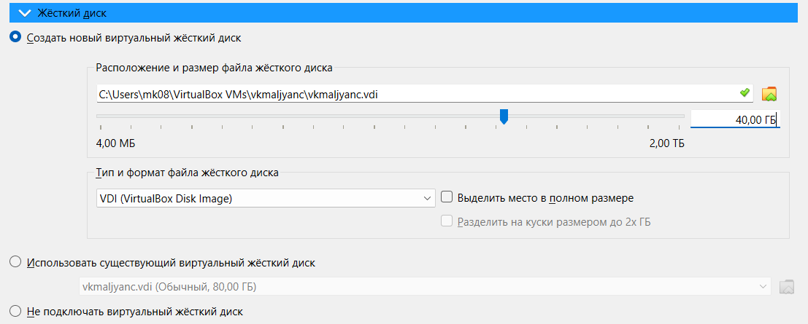{#fig-005 width=70%}

Выбрала язык ([рис. @fig-006]).

{#fig-006 width=70%}

Перешла к установке Rocky Linux ([рис. @fig-007]).

{#fig-007 width=70%}

Настроила клавиатуру ([рис. @fig-008]).

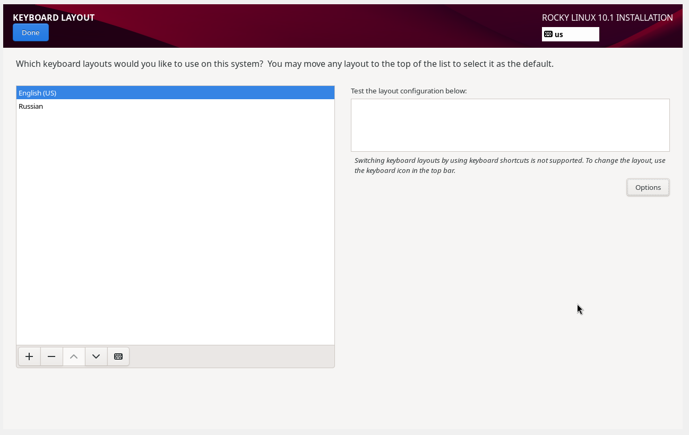{#fig-008 width=70%}

Настроила часовой пояс ([рис. @fig-009]).

{#fig-009 width=70%}

Выбрала параметры Server with GUI и Development Tools ([рис. @fig-010]).

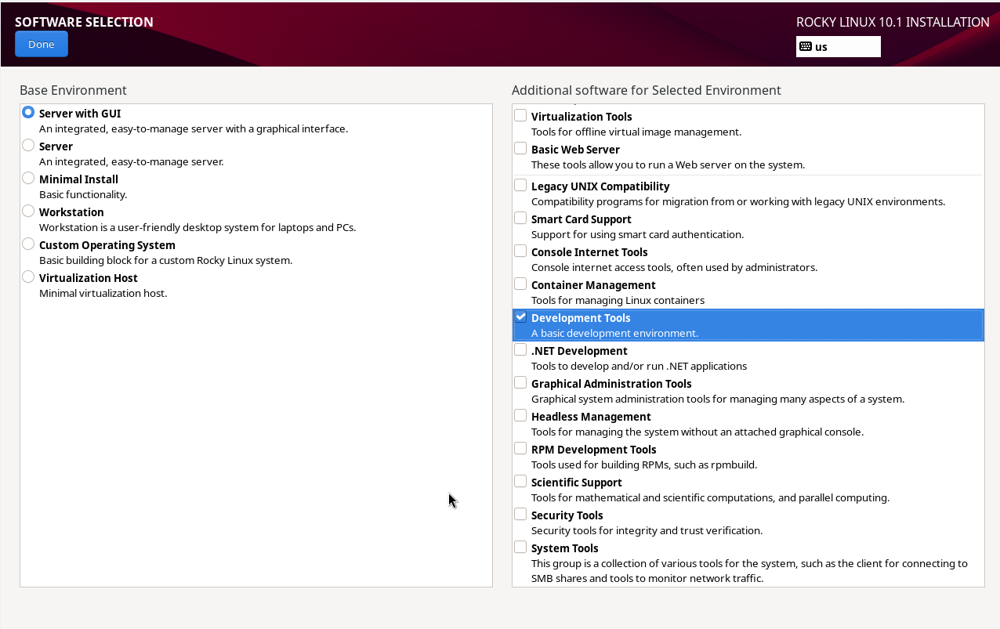{#fig-010 width=70%}

Отключила kdump ([рис. @fig-011]).

{#fig-011 width=70%}

Создала пользователя ([рис. @fig-012]).

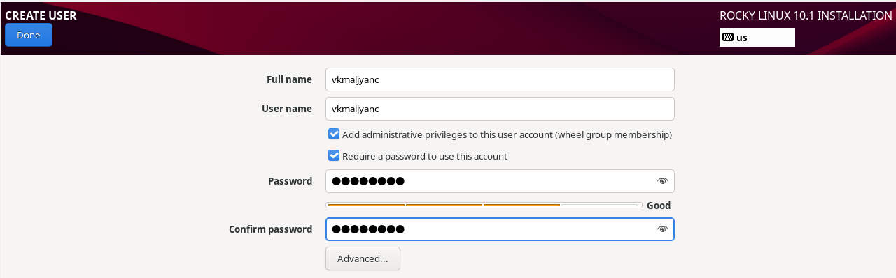{#fig-012 width=70%}

Установка завершена, перезагружаю виртуальную машину ([рис. @fig-013]).

{#fig-013 width=70%}

Вхожу в аккаунт ([рис. @fig-014]).

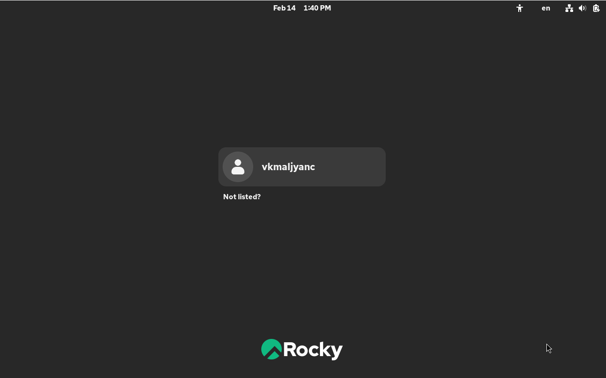{#fig-014 width=70%}

Задаю имя хоста ([рис. @fig-015]).

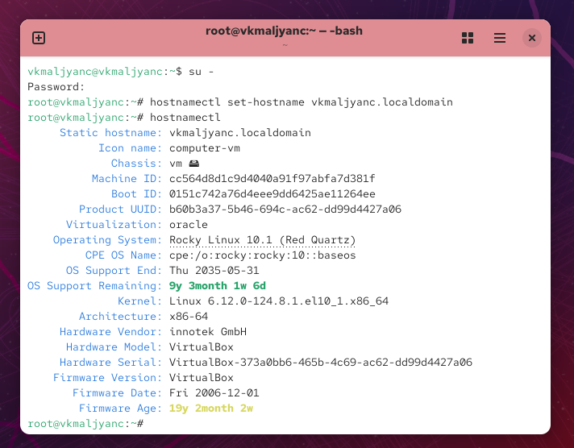{#fig-015 width=70%}

Добавила VBoxGuestAdditions.iso ([рис. @fig-016]).

{#fig-016 width=70%}

## Выполнение домашнего задания

Выполняю команду dmesg ([рис. @fig-017]).

{#fig-017 width=70%}

Выполняю команду dmesg | less ([рис. @fig-018]).

{#fig-018 width=70%}

Получаю информацию о версии ядра Linux ([рис. @fig-019]).

{#fig-019 width=70%}

Получаю информацию о частоте процессора ([рис. @fig-020]).

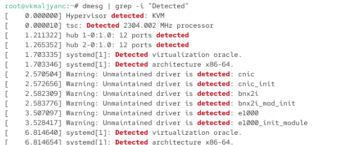{#fig-020 width=70%}

Получаю информацию о модели процессора ([рис. @fig-021]).

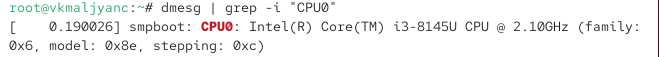{#fig-021 width=70%}

Получаю информацию об объеме доступной оперативной памяти ([рис. @fig-022]).

{#fig-022 width=70%}

Получаю информацию о типе обнаруженного гипервизора ([рис. @fig-023]).

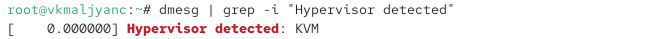{#fig-023 width=70%}

 Получаю информацию о типе файловой системы корневого раздела ([рис. @fig-024]).

{#fig-024 width=70%}

Получаю информацию о последовательности монтирования файловых систем ([рис. @fig-025]).

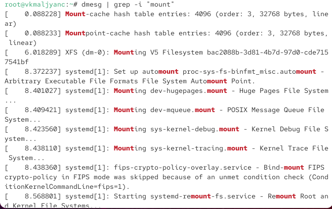{#fig-025 width=70%} 

# Выводы

Я приобрела практические навыки установки операционной системы на виртуальную машину, настройки минимально необходимых для дальнейшей работы сервисов.

# Контрольные вопросы
1. Какую информацию содержит учётная запись пользователя? Учетная запись пользователя содержит: username, UID, GID, полное имя, shell, home directory, права доступа и группы, к которым принадлежит пользователь.

2. Укажите команды терминала и приведите примеры:
– для получения справки по команде: man (пример: man cd)
– для перемещения по файловой системе: cd (пример: cd usr/local/bin)
– для просмотра содержимого каталога: ls (пример: ls /usr)
– для определения объёма каталога: du -sh (пример:  du -sh /usr/local)
– для создания / удаления каталогов / файлов: mkdir (пример: mkdir ~/.config/sway) / rmdir  (пример: rmdir ~/.config/sway)
– для задания определённых прав на файл / каталог: chmod (пример:  chmod +x)
– для просмотра истории команд: history

3. Что такое файловая система? Приведите примеры с краткой характеристикой. Файловая система - это способ организации   хранения данных на носителе информации: ex4 (высокопроизводительная система в Linux, может работать с большими объемами данных), XFS (высокопроизводительная система, может работать с большими объемами данных).

4. Как посмотреть, какие файловые системы подмонтированы в ОС? С помощью команды mount.

5. Как удалить зависший процесс? С помощью команды kill.
