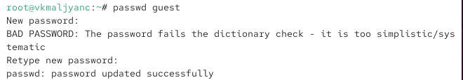
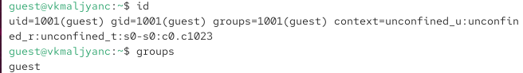
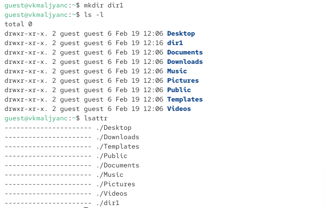
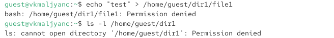
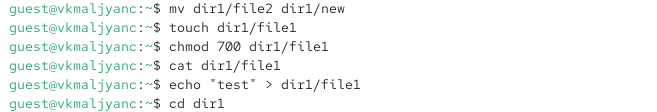

---
## Author
author:
  name: Мальянц Виктория Кареновна
  orcid: 0000-0002-0877-7063
  email: 1132246740@rudn.ru
  affiliation:
    - name: Российский университет дружбы народов
      country: Российская Федерация
      postal-code: 117198
      city: Москва
      address: ул. Миклухо-Маклая, д. 6
## Title
title: Лабораторная работа № 2
subtitle: Дискреционное разграничение прав в Linux. Основные атрибуты
license: CC BY
date: today
date-format: "YYYY-MM-DD" # Example: 2025-09-06
---

# Цель работы

- Получение практических навыков работы в консоли с атрибутами файлов, закрепление теоретических основ дискреционного разграничения доступа в современных системах с открытым кодом на базе ОС Linux.

# Задание

- Работа с атрибутами файлов
- Создание таблицы "Установленные права и разрешенные действия"
- Создание таблицы "Минимальные права для совершения операций"

# Выполнение лабораторной работы
## Работа с атрибутами файлов

- В установленной при выполнении предыдущей лабораторной работы операционной системе создаю учётную запись пользователя guest (рис. 1).

{width=70%}

## Работа с атрибутами файлов

- Создаю пароль для пользователя guest (рис. 2).

{width=70%}

## Работа с атрибутами файлов

- Вошла в систему от имени пользователя guest (рис. 3).

{width=70%}

## Работа с атрибутами файлов

- Определяю директорию, в которой нахожусь, командой pwd. Она является домашней директорией (рис. 4).

{width=70%}

## Работа с атрибутами файлов

- Уточняю имя моего пользователя командой whoami (рис. 5).

{width=70%}

## Работа с атрибутами файлов

- Уточняю имя моего пользователя, его группу, а также группы, куда входит пользователь, командой id (рис. 6).

{width=70%}

## Работа с атрибутами файлов

- Вывод команды groups совпадает с именем пользователя (рис. 7).

{width=70%}

## Работа с атрибутами файлов

- Просматриваю файл /etc/passwd командой cat /etc/passwd | grep guest (рис. 8).

{width=70%}

## Работа с атрибутами файлов

- Определяю существующие в системе директории командой ls -l /home/ (рис. 9).

{width=70%}

## Работа с атрибутами файлов

- Проверяю, какие расширенные атрибуты установлены на поддиректориях, находящихся в директории /home, командой: lsattr /home. Не удалось увидеть (рис. 10).

{width=70%}

## Работа с атрибутами файлов

- Создаю в домашней директории поддиректорию dir1 командой mkdir dir1. Определяю командами ls -l и lsattr, какие права доступа и расши-
ренные атрибуты были выставлены на директорию dir1. (рис. 11).

{width=70%}

## Работа с атрибутами файлов

- Снимаю с директории dir1 все атрибуты командой chmod 000 dir1 и проверяю с её помощью правильность выполнения команды ls -l (рис. 12).

{width=70%}

## Работа с атрибутами файлов

- Пытаюсь создать в директории dir1 файл file1 командой echo "test" > /home/guest/dir1/file1. Проверяю командой ls -l /home/guest/dir1 действительно ли файл file1 не находится внутри директории dir1 (рис. 13).

{width=70%}

## Создание таблицы "Установленные права и разрешенные действия"

- Определяю опытным путем, какие операции разрешены, а какие нет, при установлении прав на директорию и файл (рис. 14).

{width=70%}

## Создание таблицы "Установленные права и разрешенные действия"

- Продолжаю проверять какие операции будут выполняться (рис. 15).

{width=70%}

## Создание таблицы "Установленные права и разрешенные действия"

- Выполняю операцию изменения прав файла (рис. 16).

{width=70%}

## Создание таблицы "Минимальные права для совершения операций"

| | | | | |
|-|-|-|-|-|
|Операция| |Минимальные права на директорию| |Минимальные права на файл|
|Создание файла| |d(300)| |-|
|Удаление файла| |d(300)| |-|
|Удаление файла| |d(100)| |(400)|
|Запись в файл| |d(100)| |(200)|
|Переименование файла| |d(300)| |(000)|
|Создание поддиректории| |d(300)| |-|
|Удаление поддиректории| |d(300)| |-|

# Выводы

Я получила практические навыки работы в консоли с атрибутами файлов, закрепила теоретические основы дискреционного разграничения доступа в современных системах с открытым кодом на базе ОС Linux.

# Спасибо за внимание
