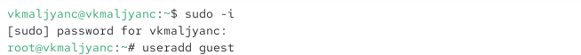
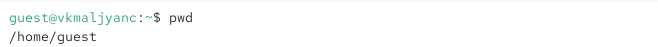
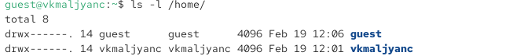
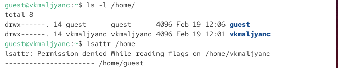
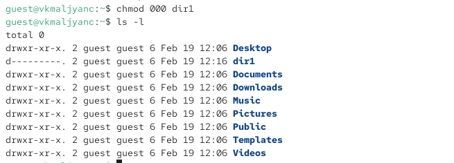
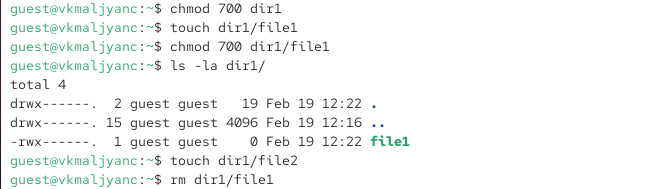

---
## Author
author:
  name: Мальянц Виктория Кареновна
  orcid: 0000-0002-0877-7063
  email: 1132246740@rudn.ru
  affiliation:
    - name: Российский университет дружбы народов
      country: Российская Федерация
      postal-code: 117198
      city: Москва
      address: ул. Миклухо-Маклая, д. 6

## Title
title: "Лабораторная работа № 2"
subtitle: "Дискреционное разграничение прав в Linux. Основные атрибуты"
license: "CC BY"
---

# Цель работы

Получение практических навыков работы в консоли с атрибутами файлов, закрепление теоретических основ дискреционного разграничения доступа в современных системах с открытым кодом на базе ОС Linux.

# Задание

1. Работа с атрибутами файлов
2. Создание таблицы "Установленные права и разрешенные действия"
3. Создание таблицы "Минимальные права для совершения операций"

# Выполнение лабораторной работы
## Работа с атрибутами файлов

В установленной при выполнении предыдущей лабораторной работы операционной системе создаю учётную запись пользователя guest ([рис. @fig-001]).

{#fig-001 width=70%}

Создаю пароль для пользователя guest ([рис. @fig-002]).

{#fig-002 width=70%}

Вошла в систему от имени пользователя guest ([рис. @fig-003]).

{#fig-003 width=70%}

Определяю директорию, в которой нахожусь, командой pwd. Она является домашней директорией ([рис. @fig-004]).

{#fig-004 width=70%}

Уточняю имя моего пользователя командой whoami ([рис. @fig-005]).

{#fig-005 width=70%}

Уточняю имя моего пользователя, его группу, а также группы, куда входит пользователь, командой id ([рис. @fig-006]).

{#fig-006 width=70%}

Вывод команды groups совпадает с именем пользователя ([рис. @fig-007]).

{#fig-007 width=70%}

Просматриваю файл /etc/passwd командой cat /etc/passwd | grep guest ([рис. @fig-008]).

{#fig-008 width=70%}

Определяю существующие в системе директории командой ls -l /home/ ([рис. @fig-009]).

{#fig-009 width=70%}

Проверяю, какие расширенные атрибуты установлены на поддиректориях, находящихся в директории /home, командой: lsattr /home. Не удалось увидеть ([рис. @fig-010]).

{#fig-010 width=70%}

Создаю в домашней директории поддиректорию dir1 командой mkdir dir1. Определяю командами ls -l и lsattr, какие права доступа и расши-
ренные атрибуты были выставлены на директорию dir1. ([рис. @fig-011]).

{#fig-011 width=70%}

Снимаю с директории dir1 все атрибуты командой chmod 000 dir1 и проверяю с её помощью правильность выполнения команды ls -l ([рис. @fig-012]).

{#fig-012 width=70%}

Пытаюсь создать в директории dir1 файл file1 командой echo "test" > /home/guest/dir1/file1. Проверяю командой ls -l /home/guest/dir1
действительно ли файл file1 не находится внутри директории dir1 ([рис. @fig-013]).

{#fig-013 width=70%}

Определяю опытным путем, какие операции разрешены, а какие нет, при установлении прав на директорию и файл ([рис. @fig-014]).

{#fig-014 width=70%}

Продолжаю проверять какие операции будут выполняться ([рис. @fig-015]).

{#fig-015 width=70%}

Выполняю операцию изменения прав файла ([рис. @fig-016]) [@lab02].

{#fig-016 width=70%}

## Создание таблицы "Установленные права и разрешенные действия"

| | | | | | | | | | |
|-|-|-|-|-|-|-|-|-|-|
|Права директории|Права файла|Создание файла|Удаление файла|Запись в файл|Чтение файла|Смена директории|Просмотр файлов в директории|Переименование файла|Смена атрибутов файла|
|d(000)|(000)|-|-|-|-|-|-|-|-|
|d(000)|(100)|-|-|-|-|-|-|-|-|
|d(000)|(200)|-|-|-|-|-|-|-|-|
|d(000)|(300)|-|-|-|-|-|-|-|-|
|d(000)|(400)|-|-|-|-|-|-|-|-|
|d(000)|(500)|-|-|-|-|-|-|-|-|
|d(000)|(600)|-|-|-|-|-|-|-|-|
|d(000)|(700)|-|-|-|-|-|-|-|-|
|d(100)|(000)|-|-|-|-|+|-|-|+|
|d(100)|(100)|-|-|-|-|+|-|-|+|
|d(100)|(200)|-|-|+|-|+|-|-|+|
|d(100)|(300)|-|-|+|-|+|-|-|+|
|d(100)|(400)|-|-|-|+|+|-|-|+|
|d(100)|(500)|-|-|-|+|+|-|-|+|
|d(100)|(600)|-|-|+|+|+|-|-|+|
|d(100)|(700)|-|-|+|+|+|-|-|+|
|d(200)|(000)|-|-|-|-|-|-|-|-|
|d(200)|(100)|-|-|-|-|-|-|-|-|
|d(200)|(200)|-|-|-|-|-|-|-|-|
|d(200)|(300)|-|-|-|-|-|-|-|-|
|d(200)|(400)|-|-|-|-|-|-|-|-|
|d(200)|(500)|-|-|-|-|-|-|-|-|
|d(200)|(600)|-|-|-|-|-|-|-|-|
|d(200)|(700)|-|-|-|-|-|-|-|-|
|d(300)|(000)|+|+|-|-|+|-|+|+|
|d(300)|(100)|+|+|-|-|+|-|+|+|
|d(300)|(200)|+|+|+|-|+|-|+|+|
|d(300)|(300)|+|+|+|-|+|-|+|+|
|d(300)|(400)|+|+|-|+|+|-|+|+|
|d(300)|(500)|+|+|-|+|+|-|+|+|
|d(300)|(600)|+|+|+|+|+|-|+|+|
|d(300)|(700)|+|+|+|+|+|-|+|+|
|d(400)|(000)|-|-|-|-|-|+|-|-|
|d(400)|(100)|-|-|-|-|-|+|-|-|
|d(400)|(200)|-|-|-|-|-|+|-|-|
|d(400)|(300)|-|-|-|-|-|+|-|-|
|d(400)|(400)|-|-|-|-|-|+|-|-|
|d(400)|(500)|-|-|-|-|-|+|-|-|
|d(400)|(600)|-|-|-|-|-|+|-|-|
|d(400)|(700)|-|-|-|-|-|+|-|-|
|d(500)|(000)|-|-|-|-|+|+|-|+|
|d(500)|(100)|-|-|-|-|+|+|-|+|
|d(500)|(200)|-|-|+|-|+|+|-|+|
|d(500)|(300)|-|-|+|-|+|+|-|+|
|d(500)|(400)|-|-|-|+|+|+|-|+|
|d(500)|(500)|-|-|-|+|+|+|-|+|
|d(500)|(600)|-|-|+|+|+|+|-|+|
|d(500)|(700)|-|-|+|+|+|+|-|+|
|d(600)|(000)|-|-|-|-|-|+|-|-|
|d(600)|(100)|-|-|-|-|-|+|-|-|
|d(600)|(200)|-|-|-|-|-|+|-|-|
|d(600)|(300)|-|-|-|-|-|+|-|-|
|d(600)|(400)|-|-|-|-|-|+|-|-|
|d(600)|(500)|-|-|-|-|-|+|-|-|
|d(600)|(600)|-|-|-|-|-|+|-|-|
|d(600)|(700)|-|-|-|-|-|+|-|-|
|d(700)|(000)|+|+|-|-|+|+|+|+|
|d(700)|(100)|+|+|-|-|+|+|+|+|
|d(700)|(200)|+|+|+|-|+|+|+|+|
|d(700)|(300)|+|+|+|-|+|+|+|+|
|d(700)|(400)|+|+|-|+|+|+|+|+|
|d(700)|(500)|+|+|-|+|+|+|+|+|
|d(700)|(600)|+|+|+|+|+|+|+|+|
|d(700)|(700)|+|+|+|+|+|+|+|+|

## Создание таблицы "Минимальные права для совершения операций"

| | | | | |
|-|-|-|-|-|
|Операция| |Минимальные права на директорию| |Минимальные права на файл|
|Создание файла| |d(300)| |-|
|Удаление файла| |d(300)| |-|
|Удаление файла| |d(100)| |(400)|
|Запись в файл| |d(100)| |(200)|
|Переименование файла| |d(300)| |(000)|
|Создание поддиректории| |d(300)| |-|
|Удаление поддиректории| |d(300)| |-|

# Выводы

Я получила практические навыки работы в консоли с атрибутами файлов, закрепила теоретические основы дискреционного разграничения доступа в современных системах с открытым кодом на базе ОС Linux.

# Список литературы{.unnumbered}

::: {#refs}
:::
