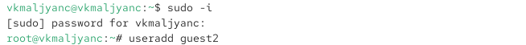
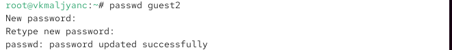
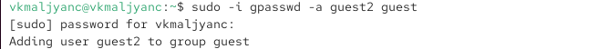
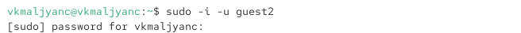
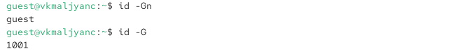

---
## Author
author:
  name: Мальянц Виктория Кареновна
  orcid: 0000-0002-0877-7063
  email: 1132246740@rudn.ru
  affiliation:
    - name: Российский университет дружбы народов
      country: Российская Федерация
      postal-code: 117198
      city: Москва
      address: ул. Миклухо-Маклая, д. 6
## Title
title: Лабораторная работа № 3
subtitle: Дискреционное разграничение прав в Linux. Два пользователя
license: CC BY
date: today
date-format: "YYYY-MM-DD" # Example: 2025-09-06
---

# Цель работы

- Получение практических навыков работы в консоли с атрибутами файлов для групп пользователей.

# Задание

- Работа с атрибутами файлов для групп пользователей
- Заполнение таблицы "Установленные права и разрешённые действия для групп"
- Заполнение таблицы "Минимальные права для совершения операций от имени пользователей входящих в группу"

# Выполнение лабораторной работы
##  Работа с атрибутами файлов для групп пользователей

- Создала пользователя guest2 (рис. 1).

{width=70%}

##  Работа с атрибутами файлов для групп пользователей

- Создала пароль для пользователя guest2 (рис. 2).

{width=70%}

##  Работа с атрибутами файлов для групп пользователей

- Добавила пользователя guest2 в группу guest (рис. 3).

{width=70%}

##  Работа с атрибутами файлов для групп пользователей

- Осуществила вход в систему от двух пользователей на двух разных консолях: guest (рис. 4) на первой консоли и guest2 на второй консоли (рис. 5).

{width=70%}

{width=70%}

##  Работа с атрибутами файлов для групп пользователей

- Для обоих пользователей командой pwd определяю директорию, в которой нахожусь, она совпадает с приглашениями командной строки (рис. 6) (рис. 7).

{width=70%}

{width=70%}

##  Работа с атрибутами файлов для групп пользователей

- Определяю командами groups guest и groups guest2, в какие группы входят пользователи guest и guest2 (рис. 8) (рис. 9).

{width=70%}

{width=70%}

##  Работа с атрибутами файлов для групп пользователей

- Сравниваю вывод команды groups с выводом команд id -Gn и id -G. (рис. 10) (рис. 11).

{width=70%}

{width=70%}

##  Работа с атрибутами файлов для групп пользователей

- Сравниваю полученную информацию с содержимым файла /etc/group. Просматриваю файл командой cat /etc/group (рис. 12).

{width=70%}

##  Работа с атрибутами файлов для групп пользователей

- Вывод команды cat /etc/group (рис. 13)).

{width=70%}

##  Работа с атрибутами файлов для групп пользователей

- От имени пользователя guest2 выполняю регистрацию пользователя guest2 в группе guest командой newgrp guest (рис. 14).

{width=70%}

##  Работа с атрибутами файлов для групп пользователей

- От имени пользователя guest изменяю права директории /home/guest, разрешив все действия для пользователей группы: chmod g+rwx /home/guest (рис. 15).

{width=70%}

##  Работа с атрибутами файлов для групп пользователей

- От имени пользователя guest снимаю с директории /home/guest/dir1 все атрибуты командой chmod 000 dir1 и проверяю правильность снятия атрибутов командой ls -l (рис. 16).

{width=70%}

## Заполнение таблицы "Установленные права и разрешённые действия для групп"

- Меняя атрибуты у директории dir1 и файла file1 от имени пользователя guest и делая проверку от пользователя guest2, определяю опытным путём, какие операции разрешены, а какие нет (рис. 17).

{#fig-017 width=70%}

## Заполнение таблицы "Минимальные права для совершения операций от имени пользователей входящих в группу"

| Операция | Минимальные права на директорию | Минимальные права на файл |
|------------------------|---------------------------------|---------------------------|
| Создание файла | ```d----wx-- (030)``` | ```--------- (000)``` |
| Удаление файла | ```d----wx-- (030)``` | ```--------- (000)``` |
| Чтение файла | ```d-----x-- (010)``` | ```----r---- (040)``` |
| Запись в файл | ```d-----x-- (010)``` | ```-----w--- (020)``` |
| Переименование файла | ```d----wx-- (030)``` | ```--------- (000)``` |
| Создание поддиректории | ```d----wx-- (030)``` | ```--------- (000)``` |
| Удаление поддиректории | ```d----wx-- (030)``` | ```--------- (000)``` |


# Выводы

- Я получила практические навыки работы в консоли с атрибутами файлов для групп пользователей.

# Спасибо за внимание
