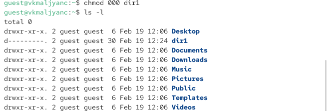
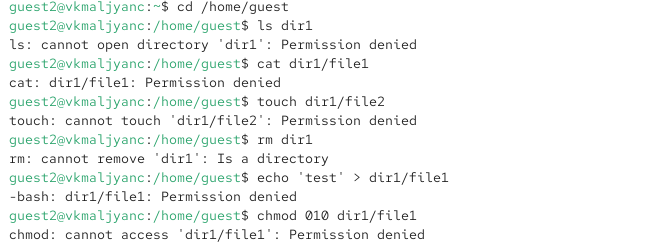

---
## Author
author:
  name: Мальянц Виктория Кареновна
  orcid: 0000-0002-0877-7063
  email: 1132246740@rudn.ru
  affiliation:
    - name: Российский университет дружбы народов
      country: Российская Федерация
      postal-code: 117198
      city: Москва
      address: ул. Миклухо-Маклая, д. 6

## Title
title: "Лабораторная работа № 3"
subtitle: "Дискреционное разграничение прав в Linux. Два пользователя"
license: "CC BY"
---

# Цель работы

Получение практических навыков работы в консоли с атрибутами файлов для групп пользователей.

# Задание

1. Работа с атрибутами файлов для групп пользователей
2. Заполнение таблицы "Установленные права и разрешённые действия для групп"
3. Заполнение таблицы "Минимальные права для совершения операций от имени пользователей входящих в группу"

# Выполнение лабораторной работы
##  Работа с атрибутами файлов для групп пользователей

Создала пользователя guest2 ([рис. @fig-001]).

{#fig-001 width=70%}

Создала пароль для пользователя guest2 ([рис. @fig-002]).

{#fig-002 width=70%}

Добавила пользователя guest2 в группу guest ([рис. @fig-003]).

{#fig-003 width=70%}

Осуществила вход в систему от двух пользователей на двух разных консолях: guest ([рис. @fig-004]) на первой консоли и guest2 на второй консоли ([рис. @fig-005]).

{#fig-004 width=70%}

{#fig-005 width=70%}

Для обоих пользователей командой pwd определяю директорию, в которой нахожусь, она совпадает с приглашениями командной строки ([рис. @fig-006]) ([рис. @fig-007]).

{#fig-006 width=70%}

{#fig-007 width=70%}

Определяю командами groups guest и groups guest2, в какие группы входят пользователи guest и guest2 ([рис. @fig-008]) ([рис. @fig-009]).

{#fig-008 width=70%}

{#fig-009 width=70%}

Сравниваю вывод команды groups с выводом команд id -Gn и id -G. ([рис. @fig-010]) ([рис. @fig-011]).

{#fig-010 width=70%}

{#fig-011 width=70%}

Сравниваю полученную информацию с содержимым файла /etc/group. Просматриваю файл командой cat /etc/group ([рис. @fig-012]).

{#fig-012 width=70%}

Вывод команды cat /etc/group ([рис. @fig-013]).

{#fig-013 width=70%}

От имени пользователя guest2 выполняю регистрацию пользователя guest2 в группе guest командой newgrp guest ([рис. @fig-014]).

{#fig-014 width=70%}

От имени пользователя guest изменяю права директории /home/guest, разрешив все действия для пользователей группы: chmod g+rwx /home/guest ([рис. @fig-015]).

{#fig-015 width=70%}

От имени пользователя guest снимаю с директории /home/guest/dir1 все атрибуты командой chmod 000 dir1 и проверяю правильность снятия атрибутов командой ls -l ([рис. @fig-016]).

{#fig-016 width=70%}

Меняя атрибуты у директории dir1 и файла file1 от имени пользователя guest и делая проверку от пользователя guest2, определяю опытным путём, какие операции разрешены, а какие нет ([рис. @fig-017]) [@lab03].

{#fig-017 width=70%}

## Заполнение таблицы "Установленные права и разрешённые действия для групп"

| Права директории | Права файла | Создание файла | Удаление файла | Запись в файл | Чтение файла | Смена директории | Просмотр файлов в директории | Переименование файла | Смена атрибутов файла |
|:---------------------|:---------------------|-----|-----|-----|-----|-----|-----|-----|-----|
|```d-------- (000)```|```--------- (000)```| - | - | - | - | - | - | - | - |
|```d-----x-- (010)```|```--------- (000)```| - | - | - | - | - | - | - | + |
|```d----w--- (020)```|```--------- (000)```| - | - | - | - | - | - | - | - |
|```d----wx-- (030)```|```--------- (000)```| + | + | - | - | + | - | + | + |
|```d---r---- (040)```|```--------- (000)```| - | - | - | - | - | + | - | - |
|```d---r-x-- (050)```|```--------- (000)```| - | - | - | - | + | + | - | + |
|```d---rw--- (060)```|```--------- (000)```| - | - | - | - | - | + | - | - |
|```d---rwx-- (070)```|```--------- (000)```| + | + | - | - | + | + | + | + |
|```d-------- (000)```|```------x-- (010)```| - | - | - | - | - | - | - | - |
|```d-----x-- (010)```|```------x-- (010)```| - | - | - | - | - | - | - | + |
|```d----w--- (020)```|```------x-- (010)```| - | - | - | - | - | - | - | - |
|```d----wx-- (030)```|```------x-- (010)```| + | + | - | - | + | - | + | + |
|```d---r---- (040)```|```------x-- (010)```| - | - | - | - | - | + | - | - |
|```d---r-x-- (050)```|```------x-- (010)```| - | - | - | - | + | + | - | + |
|```d---rw--- (060)```|```------x-- (010)```| - | - | - | - | - | + | - | - |
|```d---rwx-- (070)```|```------x-- (010)```| + | + | - | - | + | + | + | + |
|```d-------- (000)```|```-----w--- (020)```| - | - | - | - | - | - | - | - |
|```d-----x-- (010)```|```-----w--- (020)```| - | - | + | - | - | - | - | + |
|```d----w--- (020)```|```-----w--- (020)```| - | - | - | - | - | - | - | - |
|```d----wx-- (030)```|```-----w--- (020)```| + | + | + | - | + | - | + | + |
|```d---r---- (040)```|```-----w--- (020)```| - | - | - | - | - | + | - | - |
|```d---r-x-- (050)```|```-----w--- (020)```| - | - | + | - | + | + | - | + |
|```d---rw--- (060)```|```-----w--- (020)```| - | - | - | - | - | + | - | - |
|```d---rwx-- (070)```|```-----w--- (020)```| + | + | + | - | + | + | + | + |
|```d-------- (000)```|```-----wx-- (030)```| - | - | - | - | - | - | - | - |
|```d-----x-- (010)```|```-----wx-- (030)```| - | - | + | - | - | - | - | + |
|```d----w--- (020)```|```-----wx-- (030)```| - | - | - | - | - | - | - | - |
|```d----wx-- (030)```|```-----wx-- (030)```| + | + | + | - | + | - | + | + |
|```d---r---- (040)```|```-----wx-- (030)```| - | - | - | - | - | + | - | - |
|```d---r-x-- (050)```|```-----wx-- (030)```| - | - | + | - | + | + | - | + |
|```d---rw--- (060)```|```-----wx-- (030)```| - | - | - | - | - | + | - | - |
|```d---rwx-- (070)```|```-----wx-- (030)```| + | + | + | - | + | + | + | + |
|```d-------- (000)```|```----r---- (040)```| - | - | - | - | - | - | - | - |
|```d-----x-- (010)```|```----r---- (040)```| - | - | - | + | + | - | - | + |
|```d----w--- (020)```|```----r---- (040)```| - | - | - | - | - | - | - | - |
|```d----wx-- (030)```|```----r---- (040)```| + | + | - | + | + | - | + | + |
|```d---r---- (040)```|```----r---- (040)```| - | - | - | - | - | + | - | - |
|```d---r-x-- (050)```|```----r---- (040)```| - | - | - | + | + | + | - | + |
|```d---rw--- (060)```|```----r---- (040)```| - | - | - | - | - | + | - | - |
|```d---rwx-- (070)```|```----r---- (040)```| + | + | - | + | + | + | + | + |
|```d-------- (000)```|```----r-x-- (050)```| - | - | - | - | - | - | - | - |
|```d-----x-- (010)```|```----r-x-- (050)```| - | - | - | + | + | - | - | + |
|```d----w--- (020)```|```----r-x-- (050)```| - | - | - | - | - | - | - | - |
|```d----wx-- (030)```|```----r-x-- (050)```| + | + | - | + | + | - | + | + |
|```d---r---- (040)```|```----r-x-- (050)```| - | - | - | - | - | + | - | - |
|```d---r-x-- (050)```|```----r-x-- (050)```| - | - | - | + | + | + | - | + |
|```d---rw--- (060)```|```----r-x-- (050)```| - | - | - | - | - | + | - | - |
|```d---rwx-- (070)```|```----r-x-- (050)```| + | + | - | + | + | + | + | + |
|```d-------- (000)```|```----rw--- (060)```| - | - | - | - | - | - | - | - |
|```d-----x-- (010)```|```----rw--- (060)```| - | - | + | + | - | - | - | + |
|```d----w--- (020)```|```----rw--- (060)```| - | - | - | - | - | - | - | - |
|```d----wx-- (030)```|```----rw--- (060)```| + | + | + | + | + | - | + | + |
|```d---r---- (040)```|```----rw--- (060)```| - | - | - | - | - | + | - | - |
|```d---r-x-- (050)```|```----rw--- (060)```| - | - | + | + | + | + | - | + |
|```d---rw--- (060)```|```----rw--- (060)```| - | - | - | - | - | + | - | - |
|```d---rwx-- (070)```|```----rw--- (060)```| + | + | + | + | + | + | + | + |
|```d-------- (000)```|```----rwx-- (070)```| - | - | - | - | - | - | - | - |
|```d-----x-- (010)```|```----rwx-- (070)```| - | - | + | + | + | - | - | + |
|```d----w--- (020)```|```----rwx-- (070)```| - | - | - | - | - | - | - | - |
|```d----wx-- (030)```|```----rwx-- (070)```| + | + | + | + | + | - | + | + |
|```d---r---- (040)```|```----rwx-- (070)```| - | - | - | - | - | + | - | - |
|```d---r-x-- (050)```|```----rwx-- (070)```| - | - | + | + | + | + | - | + |
|```d---rw--- (060)```|```----rwx-- (070)```| - | - | - | - | - | + | - | - |
|```d---rwx-- (070)```|```----rwx-- (070)```| + | + | + | + | + | + | + | + |

## Заполнение таблицы "Минимальные права для совершения операций от имени пользователей входящих в группу"

| Операция | Минимальные права на директорию | Минимальные права на файл |
|------------------------|---------------------------------|---------------------------|
| Создание файла | ```d----wx-- (030)``` | ```--------- (000)``` |
| Удаление файла | ```d----wx-- (030)``` | ```--------- (000)``` |
| Чтение файла | ```d-----x-- (010)``` | ```----r---- (040)``` |
| Запись в файл | ```d-----x-- (010)``` | ```-----w--- (020)``` |
| Переименование файла | ```d----wx-- (030)``` | ```--------- (000)``` |
| Создание поддиректории | ```d----wx-- (030)``` | ```--------- (000)``` |
| Удаление поддиректории | ```d----wx-- (030)``` | ```--------- (000)``` |


# Выводы

Я получила практические навыки работы в консоли с атрибутами файлов для групп пользователей.

# Список литературы{.unnumbered}

::: {#refs}
:::
