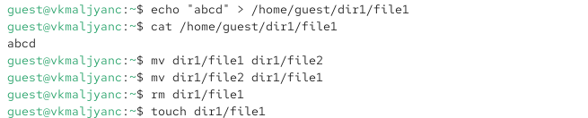
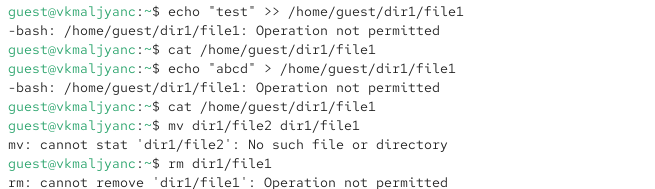

---
## Author
author:
  name: Мальянц Виктория Кареновна
  orcid: 0000-0002-0877-7063
  email: 1132246740@rudn.ru
  affiliation:
    - name: Российский университет дружбы народов
      country: Российская Федерация
      postal-code: 117198
      city: Москва
      address: ул. Миклухо-Маклая, д. 6
## Title
title: Лабораторная работа № 4
subtitle: Дискреционное разграничение прав в Linux. Расширенные атрибуты
license: CC BY
date: today
date-format: "YYYY-MM-DD" # Example: 2026-03-01
---

# Цель работы

- Получение практических навыков работы в консоли с расширенными атрибутами файлов.

# Задание

- Получение практических навыков работы в консоли с расширенными атрибутами файлов

# Выполнение лабораторной работы
## Получение практических навыков работы в консоли с расширенными атрибутами файлов

- От имени пользователя guest определяю расширенные атрибуты файла /home/guest/dir1/file1 командой lsattr /home/guest/dir1/file1 (рис. 1).

{width=70%}

## Получение практических навыков работы в консоли с расширенными атрибутами файлов

- Устанавливаю командой chmod 600 file1 на файл file1 права, разрешающие чтение и запись для владельца файла (рис. 2).

{width=70%}

## Получение практических навыков работы в консоли с расширенными атрибутами файлов

- Пробую установить на файл /home/guest/dir1/file1 расширенный атрибут a от имени пользователя guest: chattr +a /home/guest/dir1/file1. В ответ получила отказ от выполнения операции (рис. 3).

{width=70%}

## Получение практических навыков работы в консоли с расширенными атрибутами файлов

- Захожу на консоль с правами администратора. Пробую установить расширенный атрибут a на файл /home/guest/dir1/file1 от имени суперпользователя: chattr +a /home/guest/dir1/file1 (рис. 4).

{width=70%}

## Получение практических навыков работы в консоли с расширенными атрибутами файлов

- От пользователя guest проверяю правильность установления атрибута: lsattr /home/guest/dir1/file1 (рис. 5)).

{width=70%}

## Получение практических навыков работы в консоли с расширенными атрибутами файлов

- Выполняю дозапись в файл file1 слова «test» командой echo "test" >> /home/guest/dir1/file1. После этого выполняю чтение файла file1 командой cat /home/guest/dir1/file1. Убеждаюсь, что слово test было успешно записано в file1 (рис. 6).

{width=70%}

## Получение практических навыков работы в консоли с расширенными атрибутами файлов

- Пробую удалить файл file1, либо стереть имеющуюся в нём информацию. Применяю команду echo "abcd" > /home/guest/dirl/file1. Пробую переименовать файл. (рис. 7).

{width=70%}

## Получение практических навыков работы в консоли с расширенными атрибутами файлов

- Пробую с помощью команды chmod 000 file1 установить на файл file1 права, например, запрещающие чтение и запись для владельца файла. Не удалось успешно выполнить указанные команды (рис. 8).

{width=70%}

## Получение практических навыков работы в консоли с расширенными атрибутами файлов

- Снимаю расширенный атрибут a с файла /home/guest/dirl/file1 от имени суперпользователя командой chattr -a /home/guest/dir1/file1(рис. 9).

{width=70%}

## Получение практических навыков работы в консоли с расширенными атрибутами файлов

- Повторяю операции, которые ранее не удавалось выполнить. Теперь все работает (рис. 10).

{width=70%}

## Получение практических навыков работы в консоли с расширенными атрибутами файлов

- Повторяю действия по шагам, заменив атрибут «a» атрибутом «i». От имени пользователя guest получила отказ от выполнения операции (рис. 11).

{#fig-011 width=70%}

## Получение практических навыков работы в консоли с расширенными атрибутами файлов

- Захожу на консоль с правами администратора. Пробую установить расширенный атрибут i на файл /home/guest/dir1/file1 от имени суперпользователя: chattr +i /home/guest/dir1/file1(рис. 12).

{width=70%}

## Получение практических навыков работы в консоли с расширенными атрибутами файлов

- От пользователя guest проверяю правильность установления атрибута: lsattr /home/guest/dir1/file1 (рис. 13).

{width=70%}

## Получение практических навыков работы в консоли с расширенными атрибутами файлов

- Не удалось дозаписать информацию в файл, применить команду echo "abcd" > /home/guest/dirl/file1, переименовать файл, удалить файл file1 (рис. 14).

{width=70%}

# Выводы

- Я получила практические навыки работы в консоли с расширенными атрибутами файлов.

# Спасибо за внимание
