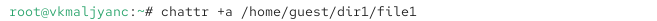
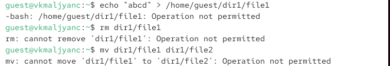
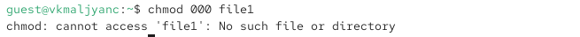

---
## Author
author:
  name: Мальянц Виктория Кареновна
  orcid: 0000-0002-0877-7063
  email: 1132246740@rudn.ru
  affiliation:
    - name: Российский университет дружбы народов
      country: Российская Федерация
      postal-code: 117198
      city: Москва
      address: ул. Миклухо-Маклая, д. 6

## Title
title: "Лабораторная работа № 4"
subtitle: "Дискреционное разграничение прав в Linux. Расширенные атрибуты"
license: "CC BY"
---

# Цель работы

Получение практических навыков работы в консоли с расширенными атрибутами файлов.

# Задание

- Получение практических навыков работы в консоли с расширенными атрибутами файлов

# Выполнение лабораторной работы
## Получение практических навыков работы в консоли с расширенными атрибутами файлов

От имени пользователя guest определяю расширенные атрибуты файла /home/guest/dir1/file1 командой lsattr /home/guest/dir1/file1 ([рис. @fig-001]).

{#fig-001 width=70%}

Устанавливаю командой chmod 600 file1 на файл file1 права, разрешающие чтение и запись для владельца файла ([рис. @fig-002]).

{#fig-002 width=70%}

Пробую установить на файл /home/guest/dir1/file1 расширенный атрибут a от имени пользователя guest: chattr +a /home/guest/dir1/file1. В ответ получила отказ от выполнения операции ([рис. @fig-003]).

{#fig-003 width=70%}

Захожу на консоль с правами администратора. Пробую установить расширенный атрибут a на файл /home/guest/dir1/file1 от имени суперпользователя: chattr +a /home/guest/dir1/file1 ([рис. @fig-004]).

{#fig-004 width=70%}

От пользователя guest проверяю правильность установления атрибута: lsattr /home/guest/dir1/file1 ([рис. @fig-005]).

{#fig-005 width=70%}

Выполняю дозапись в файл file1 слова «test» командой echo "test" >> /home/guest/dir1/file1. После этого выполняю чтение файла file1 командой cat /home/guest/dir1/file1. Убеждаюсь, что слово test было успешно записано в file1 ([рис. @fig-006]).

{#fig-006 width=70%}

Пробую удалить файл file1, либо стереть имеющуюся в нём информацию. Применяю команду echo "abcd" > /home/guest/dirl/file1. Пробую переименовать файл. ([рис. @fig-007]).

{#fig-007 width=70%}

Пробую с помощью команды chmod 000 file1 установить на файл file1 права, например, запрещающие чтение и запись для владельца файла. Не удалось успешно выполнить указанные команды ([рис. @fig-008]).

{#fig-008 width=70%}

Снимаю расширенный атрибут a с файла /home/guest/dirl/file1 от имени суперпользователя командой chattr -a /home/guest/dir1/file1 ([рис. @fig-009]).

{#fig-009 width=70%}

Повторяю операции, которые ранее не удавалось выполнить. Теперь все работает ([рис. @fig-010]).

{#fig-010 width=70%}

Повторяю действия по шагам, заменив атрибут «a» атрибутом «i». От имени пользователя guest получила отказ от выполнения операции ([рис. @fig-011]).

{#fig-011 width=70%}

Захожу на консоль с правами администратора. Пробую установить расширенный атрибут i на файл /home/guest/dir1/file1 от имени суперпользователя: chattr +i /home/guest/dir1/file1 ([рис. @fig-012]).

{#fig-012 width=70%}

От пользователя guest проверяю правильность установления атрибута: lsattr /home/guest/dir1/file1 ([рис. @fig-013]).

{#fig-013 width=70%}

Не удалось дозаписать информацию в файл, применить команду echo "abcd" > /home/guest/dirl/file1, переименовать файл, удалить файл file1 ([рис. @fig-014]) [@lab04].

{#fig-014 width=70%}

# Выводы

Я получила практические навыки работы в консоли с расширенными атрибутами файлов.

# Список литературы{.unnumbered}

::: {#refs}
:::
