---
## Author
author:
  name: Мальянц Виктория Кареновна
  orcid: 0000-0002-0877-7063
  email: 1132246740@rudn.ru
  affiliation:
    - name: Российский университет дружбы народов
      country: Российская Федерация
      postal-code: 117198
      city: Москва
      address: ул. Миклухо-Маклая, д. 6
## Title
title: Лабораторная работа № 5
subtitle: Дискреционное разграничение прав в Linux. Исследование влияния дополнительных атрибутов
license: CC BY
date: today
date-format: "2026-04-03" # Example: 2025-09-06
---

# Цель работы

- Изучение механизмов изменения идентификаторов, применения SetUID- и Sticky-битов. Получение практических навыков работы в консоли с дополнительными атрибутами. Рассмотрение работы механизма смены идентификатора процессов пользователей, а также влияние бита Sticky на запись и удаление файлов.

# Задание

- Подготовка лабораторного стенда
- Создание программы
- Исследование Sticky-бита

# Выполнение лабораторной работы
## Подготовка лабораторного стенда

- Убеждаюсь, что в системе установлен компилятор gcc с помощью команды gcc -v (рис. 1).

{width=70%}

## Подготовка лабораторного стенда

- Отключаю систему запретов до очередной перезагрузки системы командой sudo setenforce 0. После этого команда getenforce выводит Permissive  (рис. 2).

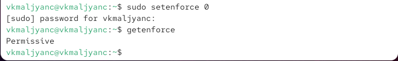{width=70%}

## Создание программы

- Вхожу в систему от имени пользователя guest с помощью команды sudo -u guest -i  (рис. 3).

{width=70%}

## Создание программы

- Создаю программу simpleid.c  (рис. 4).

{width=70%}

## Создание программы

- Код программы simpleid.c  (рис. 5).

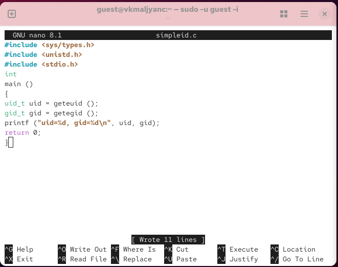{width=70%}

## Создание программы

- Компилирую программу и убеждаюсь, что файл программы создан: gcc simpleid.c -o simpleid (рис. 6).

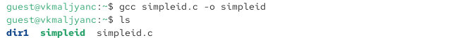{width=70%}

## Создание программы

- Выполняю программу simpleid: ./simpleid. Команда id выводит номера пользователя и групп  (рис. 7).

{width=70%}

## Создание программы

- Создаю программу simpleid2.c (рис. 8).

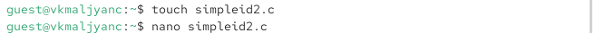{width=70%}

## Создание программы

- Код программы simpleid2.c  (рис. 9).

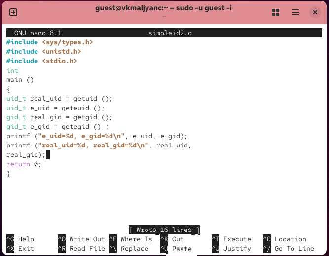{width=70%}

## Создание программы

- Компилирую и запускаю simpleid2.c. Применение команды gcc simpleid2.c -o simpleid2 и ./simpleid2 (рис. 10).

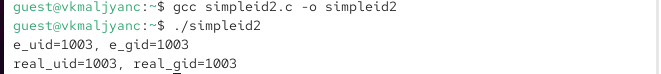{width=70%}

## Создание программы

- От имени суперпользователя выполняю команды: chown root:guest /home/guest/simpleid2 и chmod u+s /home/guest/simpleid2 (рис. 11).

{width=70%}

## Создание программы

- Выполняю проверку правильности установки новых атрибутов и смены владельца файла simpleid2: ls -l simpleid2 (рис. 12).

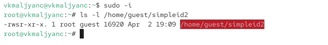{width=70%}

## Создание программы

- Запускаю simpleid2 и id: ./simpleid2 и id. Вывод команды id более подробный (рис. 13).

{width=70%}

## Создание программы

- Создаю программу readfile.c (рис. 14).

{width=70%}

## Создание программы

- Код программы readfile.c (рис. 15).

{width=70%}

## Создание программы

- Компилирую её с помощью команды gcc readfile.c -o readfile (рис. 16).

{width=70%}

## Создание программы

- Меняю владельца у файла readfile.c и изменяю права так, чтобы только суперпользователь (root) мог прочитать его, a guest не мог (рис. 17).

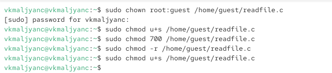{width=70%}

## Создание программы

- Проверяю, что пользователь guest не может прочитать файл readfile.c (рис. 18).

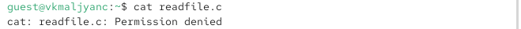{width=70%}

## Создание программы

- Меняю у программы readfile владельца и устанавливаю SetU’D-бит. Проверяю, может ли программа readfile прочитать файл readfile.c (рис. 19).

{width=70%}

## Создание программы

- Проверяю, может ли программа readfile прочитать файл /etc/shadow (рис. 20).

{width=70%}

## Создание программы

- Проверяю, может ли программа readfile прочитать файл /etc/shadow от суперпользователя (рис. 21).

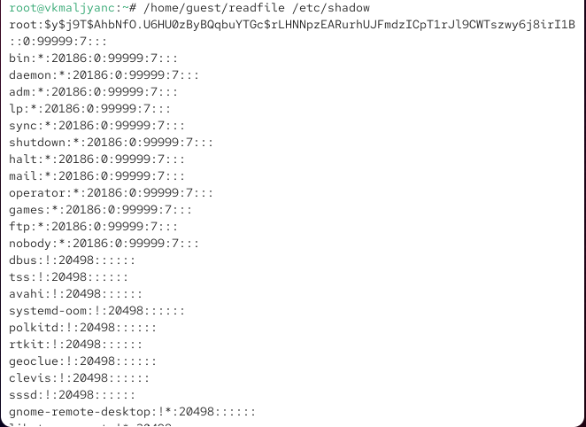{width=70%}

## Исследование Sticky-бита

- Выясняю, установлен ли атрибут Sticky на директории /tmp, выполняю команду ls -l / | grep tmp  (рис. 22).

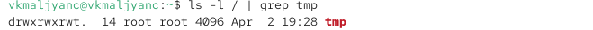{width=70%}

## Исследование Sticky-бита

- От имени пользователя guest создаю файл file01.txt в директории /tmp со словом test: echo "test" > /tmp/file01.txt  (рис. 23).

{width=70%}

## Исследование Sticky-бита

- Просматриваю атрибуты у только что созданного файла и разрешаю чтение и запись для категории пользователей «все остальные»:
ls -l /tmp/file01.txt
chmod o+rw /tmp/file01.txt
ls -l /tmp/file01.txt  (рис. 24).

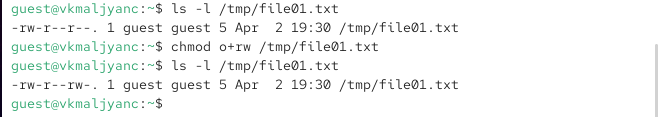{width=70%}

## Исследование Sticky-бита

- От пользователя guest2 (не являющегося владельцем) пробую прочитать файл /tmp/file01.txt: cat /tmp/file01.txt  (рис. 25).

{width=70%}

## Исследование Sticky-бита

- От пользователя guest2 пробую дозаписать в файл /tmp/file01.txt слово test2 командой echo "test2" > /tmp/file01.txt. Не удалось выполнить операцию  (рис. 26).

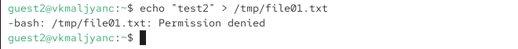{width=70%}

## Исследование Sticky-бита

- Проверяю содержимое файла командой cat /tmp/file01.txt  (рис. 27).

{width=70%}

## Исследование Sticky-бита

- От пользователя guest2 пробую записать в файл /tmp/file01.txt слово test3, стерев при этом всю имеющуюся в файле информацию командой echo "test3" > /tmp/file01.txt. Не удалось выполнить операцию  (рис. 28).

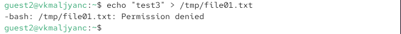{width=70%}

## Исследование Sticky-бита

- Проверяю содержимое файла командой cat /tmp/file01.txt  (рис. 29).

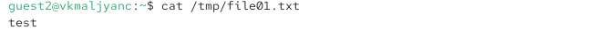{width=70%}

## Исследование Sticky-бита

- От пользователя guest2 пробую удалить файл /tmp/file01.txt командой rm /tmp/fileOl.txt Не удалось удалить файл  (рис. 30).

{width=70%}

## Исследование Sticky-бита

- Повышаю свои права до суперпользователя следующей командой su - и выполняю после этого команду, снимающую атрибут t (Sticky-бит) с директории /tmp: chmod -t /tmp (рис. 31).

{width=70%}

## Исследование Sticky-бита

- Покидаю режим суперпользователя командой exit (рис. 32).

{width=70%}

## Исследование Sticky-бита

- От пользователя guest2 проверяю, что атрибута t у директории /tmp нет: ls -l / | grep tmp (рис. 33).

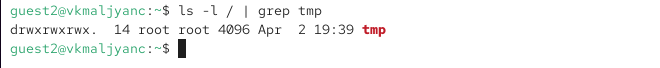{width=70%}

## Исследование Sticky-бита

- Повторяю предыдущие шаги. Удалось удалить файл (рис. 34).

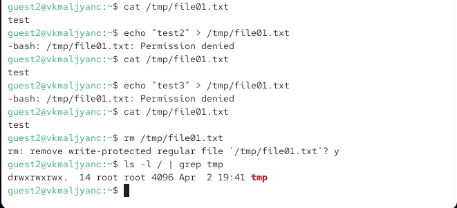{width=70%}

## Исследование Sticky-бита

- Повышаю свои права до суперпользователя и возвращаю атрибут t на директорию /tmp:
su -
chmod +t /tmp
exit (рис. 35).

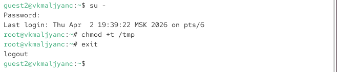{width=70%}

# Выводы

- Я изучила механизмы изменения идентификаторов, применения SetUID- и Sticky-битов. Получила практические навыкы работы в консоли с дополнительными атрибутами. Рассмотрела работу механизма смены идентификатора процессов пользователей, а также влияние бита Sticky на запись и удаление файлов.

# Спасибо за внимание
