---
## Author
author:
  name: Мальянц Виктория Кареновна
  orcid: 0000-0002-0877-7063
  email: 1132246740@rudn.ru
  affiliation:
    - name: Российский университет дружбы народов
      country: Российская Федерация
      postal-code: 117198
      city: Москва
      address: ул. Миклухо-Маклая, д. 6

## Title
title: "Лабораторная работа № 5"
subtitle: "Дискреционное разграничение прав в Linux. Исследование влияния дополнительных атрибутов"
license: "CC BY"
---

# Цель работы

Изучение механизмов изменения идентификаторов, применения SetUID- и Sticky-битов. Получение практических навыков работы в консоли с дополнительными атрибутами. Рассмотрение работы механизма смены идентификатора процессов пользователей, а также влияние бита Sticky на запись и удаление файлов.

# Задание

1. Подготовка лабораторного стенда
2. Создание программы
3. Исследование Sticky-бита

# Выполнение лабораторной работы
## Подготовка лабораторного стенда

Убеждаюсь, что в системе установлен компилятор gcc с помощью команды gcc -v ([рис. @fig-001]).

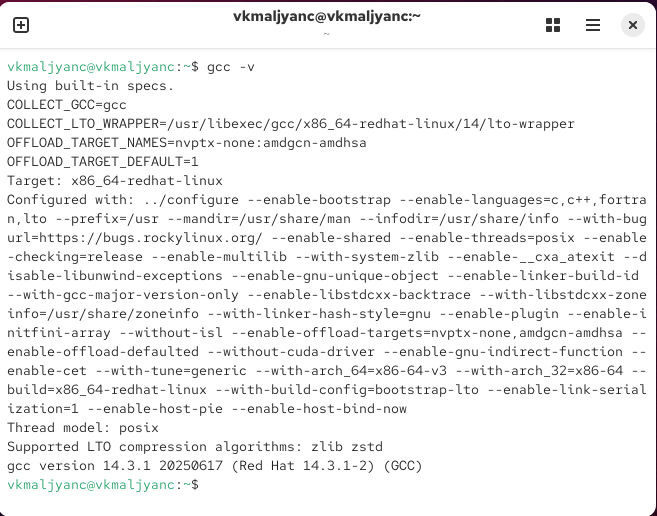{#fig-001 width=70%}

Отключаю систему запретов до очередной перезагрузки системы командой sudo setenforce 0. После этого команда getenforce выводит Permissive ([рис. @fig-002]).

{#fig-002 width=70%}

## Создание программы

Вхожу в систему от имени пользователя guest с помощью команды sudo -u guest -i ([рис. @fig-003]).

{#fig-003 width=70%}

Создаю программу simpleid.c ([рис. @fig-004]).

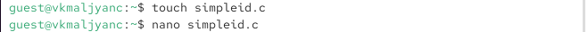{#fig-004 width=70%}

Листинг программы simpleid.c:

```
#include <sys/types.h>
#include <unistd.h>
#include <stdio.h>
int
main ()
{
uid_t uid = geteuid ();
gid_t gid = getegid ();
printf ("uid=%d, gid=%d\n", uid, gid);
return 0;
}
```

Код программы simpleid.c ([рис. @fig-005]).

{#fig-005 width=70%}

Компилирую программу и убеждаюсь, что файл программы создан: gcc simpleid.c -o simpleid ([рис. @fig-006]).

{#fig-006 width=70%}

Выполняю программу simpleid: ./simpleid. Команда id выводит номера пользователя и групп ([рис. @fig-007]).

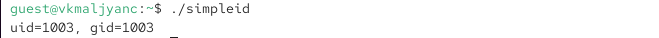{#fig-007 width=70%}

Создаю программу simpleid2.c ([рис. @fig-008]).

{#fig-008 width=70%}

Листинг программы simpleid2.c:

```
#include <sys/types.h>
#include <unistd.h>
#include <stdio.h>
int
main ()
{
uid_t real_uid = getuid ();
uid_t e_uid = geteuid ();
gid_t real_gid = getgid ();
gid_t e_gid = getegid () ;
printf ("e_uid=%d, e_gid=%d\n", e_uid, e_gid);
printf ("real_uid=%d, real_gid=%d\n", real_uid,
real_gid);↪→
return 0;
}
```

Код программы simpleid2.c  ([рис. @fig-009]).

{#fig-009 width=70%}

Компилирую и запускаю simpleid2.c. Применение команды gcc simpleid2.c -o simpleid2 и ./simpleid2 ([рис. @fig-010]).

{#fig-010 width=70%}

От имени суперпользователя выполняю команды: chown root:guest /home/guest/simpleid2 и chmod u+s /home/guest/simpleid2 ([рис. @fig-011]).

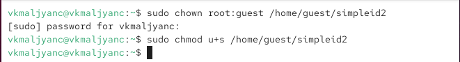{#fig-011 width=70%}

Выполняю проверку правильности установки новых атрибутов и смены владельца файла simpleid2: ls -l simpleid2 ([рис. @fig-012]).

{#fig-012 width=70%}

Запускаю simpleid2 и id: ./simpleid2 и id. Вывод команды id более подробный ([рис. @fig-013]).

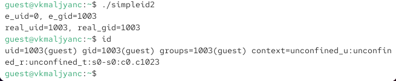{#fig-013 width=70%}

Создаю программу readfile.c ([рис. @fig-014]).

{#fig-014 width=70%}

Листинг программы readfile.c:

```
#include <fcntl.h>
#include <stdio.h>
#include <sys/stat.h>
#include <sys/types.h>
#include <unistd.h>
int
main (int argc, char* argv[])
{
unsigned char buffer[16];
size_t bytes_read;
int i;
int fd = open (argv[1], O_RDONLY);
do
{
bytes_read = read (fd, buffer, sizeof (buffer));
for (i =0; i < bytes_read; ++i) printf("%c", buffer[i]);
}
```

Код программы readfile.c ([рис. @fig-015]).

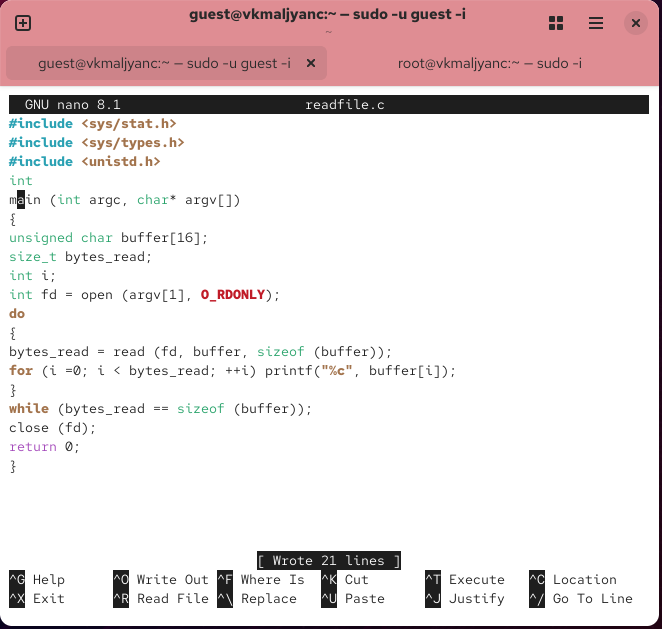{#fig-015 width=70%}

Компилирую её с помощью команды gcc readfile.c -o readfile ([рис. @fig-016]).

{#fig-016 width=70%}

Меняю владельца у файла readfile.c и изменяю права так, чтобы только суперпользователь (root) мог прочитать его, a guest не мог ([рис. @fig-017]).

{#fig-017 width=70%}

Проверяю, что пользователь guest не может прочитать файл readfile.c ([рис. @fig-018]).

{#fig-018 width=70%}

Меняю у программы readfile владельца и устанавливаю SetU’D-бит. Проверяю, может ли программа readfile прочитать файл readfile.c ([рис. @fig-019]).

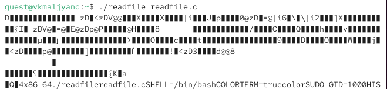{#fig-019 width=70%}

Проверяю, может ли программа readfile прочитать файл /etc/shadow ([рис. @fig-020]).

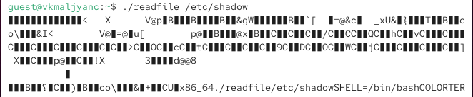{#fig-020 width=70%}

Проверяю, может ли программа readfile прочитать файл /etc/shadow от суперпользователя ([рис. @fig-021]).

{#fig-021 width=70%}

## Исследование Sticky-бита

Выясняю, установлен ли атрибут Sticky на директории /tmp, выполняю команду ls -l / | grep tmp ([рис. @fig-022]).

{#fig-022 width=70%}

От имени пользователя guest создаю файл file01.txt в директории /tmp со словом test: echo "test" > /tmp/file01.txt ([рис. @fig-023]).

{#fig-023 width=70%}

Просматриваю атрибуты у только что созданного файла и разрешаю чтение и запись для категории пользователей «все остальные»:
ls -l /tmp/file01.txt
chmod o+rw /tmp/file01.txt
ls -l /tmp/file01.txt ([рис. @fig-024]).

{#fig-024 width=70%}

От пользователя guest2 (не являющегося владельцем) пробую прочитать файл /tmp/file01.txt: cat /tmp/file01.txt ([рис. @fig-025]).

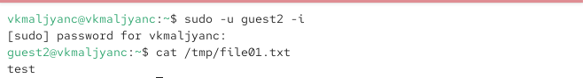{#fig-025 width=70%}

От пользователя guest2 пробую дозаписать в файл /tmp/file01.txt слово test2 командой echo "test2" > /tmp/file01.txt. Не удалось выполнить операцию ([рис. @fig-026]).

{#fig-026 width=70%}

Проверяю содержимое файла командой cat /tmp/file01.txt ([рис. @fig-027]).

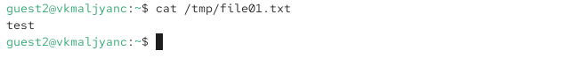{#fig-027 width=70%}

От пользователя guest2 пробую записать в файл /tmp/file01.txt слово test3, стерев при этом всю имеющуюся в файле информацию командой echo "test3" > /tmp/file01.txt. Не удалось выполнить операцию ([рис. @fig-028]).

{#fig-028 width=70%}

Проверяю содержимое файла командой cat /tmp/file01.txt ([рис. @fig-029]).

{#fig-029 width=70%}

От пользователя guest2 пробую удалить файл /tmp/file01.txt командой rm /tmp/fileOl.txt Не удалось удалить файл ([рис. @fig-030]).

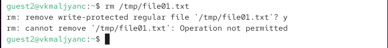{#fig-030 width=70%}

Повышаю свои права до суперпользователя следующей командой su - и выполняю после этого команду, снимающую атрибут t (Sticky-бит) с
директории /tmp: chmod -t /tmp ([рис. @fig-031]).

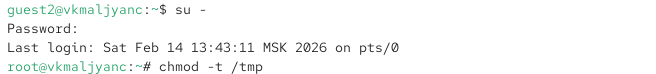{#fig-031 width=70%}

Покидаю режим суперпользователя командой exit ([рис. @fig-032]).

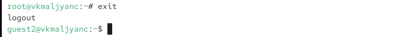{#fig-032 width=70%}

От пользователя guest2 проверяю, что атрибута t у директории /tmp нет: ls -l / | grep tmp ([рис. @fig-033]).

{#fig-033 width=70%}

Повторяю предыдущие шаги. Удалось удалить файл ([рис. @fig-034]).

{#fig-034 width=70%}

Повышаю свои права до суперпользователя и возвращаю атрибут t на директорию /tmp:
su -
chmod +t /tmp
exit ([рис. @fig-035]) [@lab05].

{#fig-035 width=70%}

# Выводы

Я изучила механизмы изменения идентификаторов, применения SetUID- и Sticky-битов. Получила практические навыкы работы в консоли с дополнительными атрибутами. Рассмотрела работу механизма смены идентификатора процессов пользователей, а также влияние бита Sticky на запись и удаление файлов.

# Список литературы{.unnumbered}

::: {#refs}
:::
