---
## Author
author:
  name: Мальянц Виктория Кареновна
  orcid: 0000-0002-0877-7063
  email: 1132246740@rudn.ru
  affiliation:
    - name: Российский университет дружбы народов
      country: Российская Федерация
      postal-code: 117198
      city: Москва
      address: ул. Миклухо-Маклая, д. 6
## Title
title: Лабораторная работа № 6
subtitle: Мандатное разграничение прав в Linux
license: CC BY
date: today
date-format: "YYYY-MM-DD" # Example: 2025-09-06
---

# Цель работы

- Развить навыки администрирования ОС Linux. Получить первое практическое знакомство с технологией SELinux1. Проверить работу SELinux на практике совместно с веб-сервером Apache.

# Задание

- Развить навыки администрирования ОС Linux

# Выполнение лабораторной работы
## Развить навыки администрирования ОС Linux

- Вхожу в систему с полученными учётными данными и убеждаюсь, что SELinux работает в режиме enforcing политики targeted с помощью команд getenforce и sestatus (рис. 1).

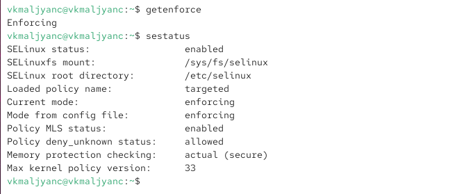{width=70%}

## Развить навыки администрирования ОС Linux

- Обращаюсь с помощью браузера к веб-серверу, запущенному на моем компьютере, и убеждаюсь, что последний работает: service httpd status (рис. 2).

{width=70%}

## Развить навыки администрирования ОС Linux

- Нахожу веб-сервер Apache в списке процессов, определяю его контекст безопасности. Ипользую команду ps auxZ | grep httpd (рис. 3).

{width=70%}

## Развить навыки администрирования ОС Linux

- Смотрю текущее состояние переключателей SELinux для Apache с помощью команды sestatus -b httpd (рис. 4).

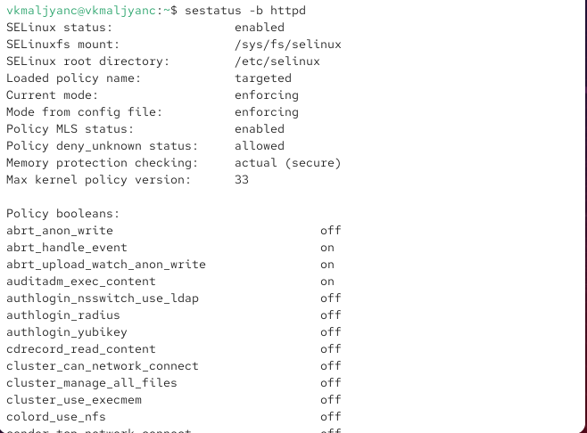{width=70%}

## Развить навыки администрирования ОС Linux

- Смотрю статистику по политике с помощью команды seinfo, также определяю множество пользователей, ролей, типов (рис. 5).

{width=70%}

## Развить навыки администрирования ОС Linux

- Определяю тип файлов и поддиректорий, находящихся в директории /var/www, с помощью команды ls -lZ /var/www (рис. 6).

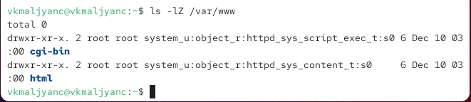{width=70%}

## Развить навыки администрирования ОС Linux

- Определяю тип файлов, находящихся в директории /var/www/html: ls -lZ /var/www/html (рис. 7).

{width=70%}

## Развить навыки администрирования ОС Linux

- Создаю от имени суперпользователя (так как в дистрибутиве после установки только ему разрешена запись в директорию) html-файл /var/www/html/test.html (рис. 8).

{width=70%}

## Развить навыки администрирования ОС Linux

- Проверяю контекст созданного мною файла (рис. 9).

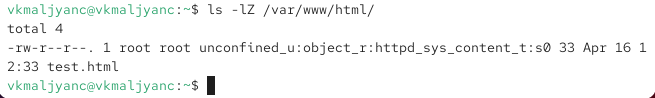{width=70%}

## Развить навыки администрирования ОС Linux

- Обращаюсь к файлу через веб-сервер, введя в браузере адрес http://127.0.0.1/test.html. Убеждаюсь, что файл был успешно отображён (рис. 10).

{width=70%}

## Развить навыки администрирования ОС Linux

- Изучаю справку man httpd selinux (рис. 11).

{width=70%}

## Развить навыки администрирования ОС Linux

- Изменяю контекст файла /var/www/html/test.html с httpd_sys_content_t на любой другой, к которому процесс httpd не должен иметь доступа, например, на samba_share_t: chcon -t samba_share_t /var/www/html/test.html
ls -Z /var/www/html/test.htm (рис. 12).

{width=70%}

## Развить навыки администрирования ОС Linux

- Пробую ещё раз получить доступ к файлу через веб-сервер, введя в браузере адрес http://127.0.0.1/test.html. Получила сообщение об ошибке (рис. 13).

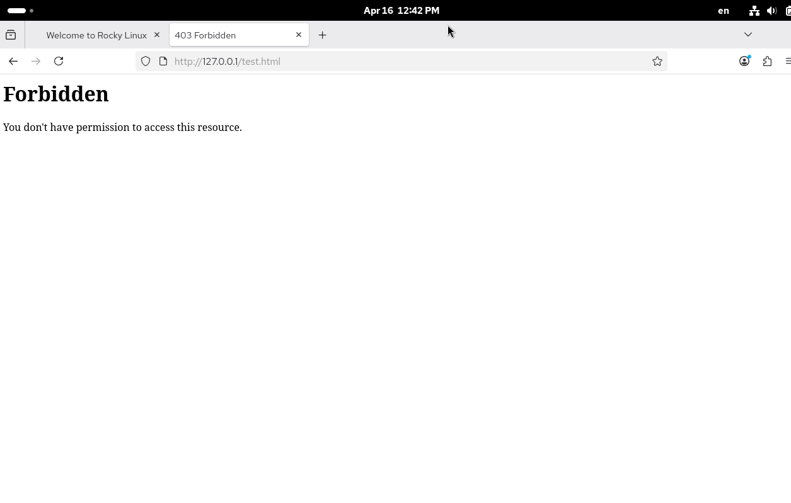{width=70%}

## Развить навыки администрирования ОС Linux

- Просматриваю log-файлы веб-сервера Apache. Также просматриваю системный лог-файл: tail /var/log/messages. Также просматриваю файл /var/log/audit/audit.log (рис. 14).

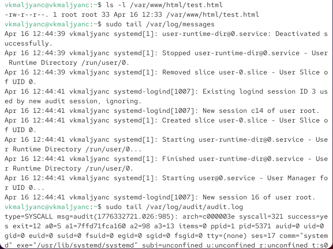{width=70%}

## Развить навыки администрирования ОС Linux

- Пробую запустить веб-сервер Apache на прослушивание ТСР-порта 81 (рис. 15).

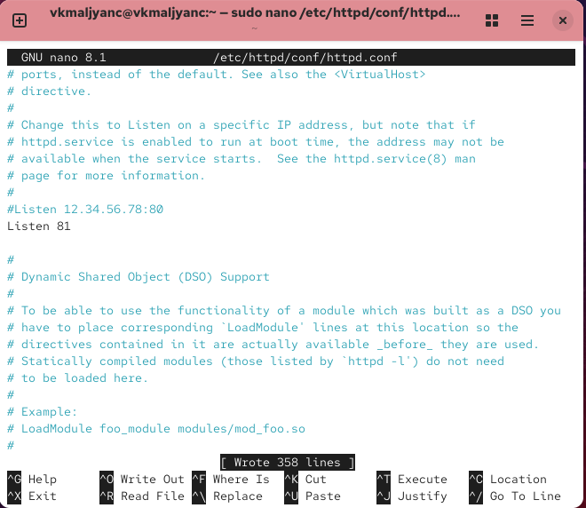{width=70%}

## Развить навыки администрирования ОС Linux

- Произошел сбой (рис. 16).

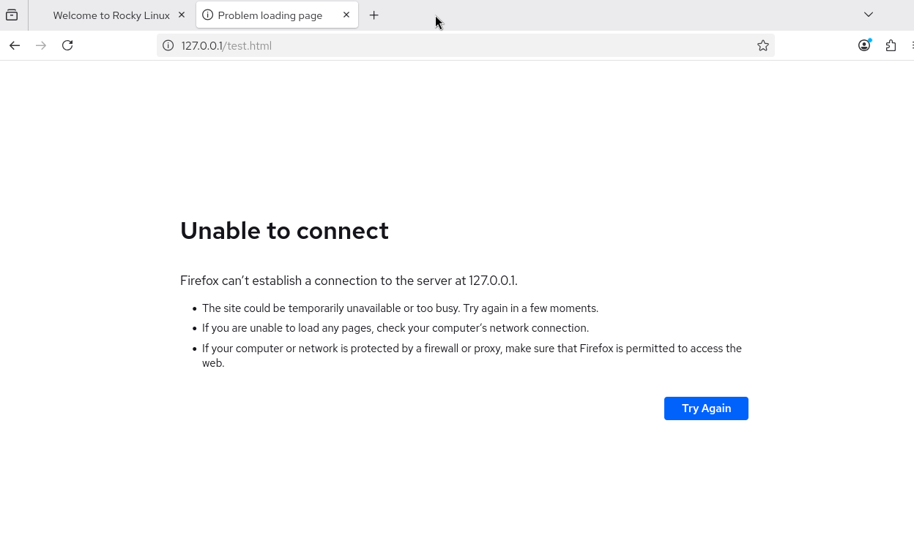{width=70%}

## Развить навыки администрирования ОС Linux

- Анализирую лог-файлы: tail -nl /var/log/messages. Просматриваю файлы /var/log/http/error_log, /var/log/http/access_log и /var/log/audit/audit.log (рис. 17).

{width=70%}

## Развить навыки администрирования ОС Linux

- Просматриваю файл /var/log/http/error_log  (рис. 18).

{width=70%}

## Развить навыки администрирования ОС Linux

- Просматриваю файл var/log/http/access_log  (рис. 19).

{width=70%}

## Развить навыки администрирования ОС Linux

- Просматриваю файл /var/log/audit/audit.log  (рис. 20).

{width=70%}

## Развить навыки администрирования ОС Linux

- Выполняю команду semanage port -a -t http_port_t -р tcp 81. После этого проверяю список портов командой semanage port -l | grep http_port_t. Убеждаюсь, что порт 81 появился в списке (рис. 21).

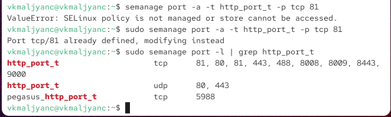{width=70%}

## Развить навыки администрирования ОС Linux

- Перезапускаю веб-сервер Apache (рис. 22).

{width=70%}

## Развить навыки администрирования ОС Linux

- Возвращаю контекст httpd_sys_cоntent__t к файлу /var/www/html/ test.html: chcon -t httpd_sys_content_t /var/www/html/test.html (рис. 23).

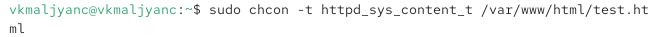{width=70%}

## Развить навыки администрирования ОС Linux

- Пробую получить доступ к файлу через веб-сервер, введя в браузере адрес http://127.0.0.1:81/test.html (рис. 24).

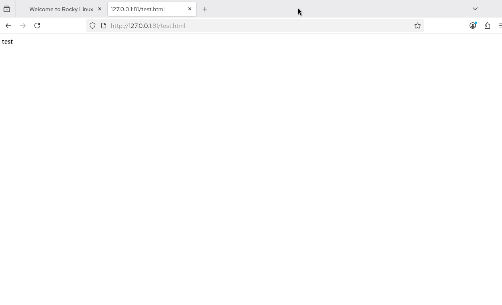{width=70%}

## Развить навыки администрирования ОС Linux

- Исправляю обратно конфигурационный файл apache, вернув Listen 80 (рис. 25).

{width=70%}

## Развить навыки администрирования ОС Linux

- Удаляю привязку http_port_t к 81 порту: semanage port -d -t http_port_t -p tcp 81 и проверяю, что порт 81 удалён (рис. 26).

{width=70%}

## Развить навыки администрирования ОС Linux

- Удаляю файл /var/www/html/test.html: rm /var/www/html/test.html (рис. 27).

{width=70%}

# Выводы

- Я развила навыки администрирования ОС Linux. Получила первое практическое знакомство с технологией SELinux1. Проверила работу SELinux на практике совместно с веб-сервером Apache.

# Спасибо за внимание
