---
## Author
author:
  name: Мальянц Виктория Кареновна
  orcid: 0000-0002-0877-7063
  email: 1132246740@rudn.ru
  affiliation:
    - name: Российский университет дружбы народов
      country: Российская Федерация
      postal-code: 117198
      city: Москва
      address: ул. Миклухо-Маклая, д. 6

## Title
title: "Лабораторная работа № 6"
subtitle: "Мандатное разграничение прав в Linux"
license: "CC BY"
---

# Цель работы

Развить навыки администрирования ОС Linux. Получить первое практическое знакомство с технологией SELinux1. Проверить работу SELinux на практике совместно с веб-сервером Apache.

# Задание

1. Развить навыки администрирования ОС Linux

# Выполнение лабораторной работы
## Развить навыки администрирования ОС Linux

Вхожу в систему с полученными учётными данными и убеждаюсь, что SELinux работает в режиме enforcing политики targeted с помощью команд getenforce и sestatus ([рис. @fig-001]).

{#fig-001 width=70%}

Обращаюсь с помощью браузера к веб-серверу, запущенному на моем компьютере, и убеждаюсь, что последний работает: service httpd status ([рис. @fig-002]).

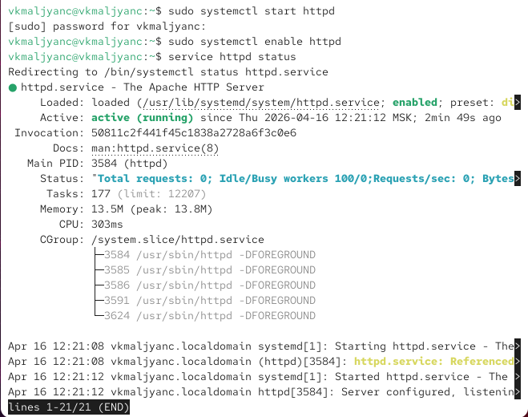{#fig-002 width=70%}

Нахожу веб-сервер Apache в списке процессов, определяю его контекст безопасности. Ипользую команду ps auxZ | grep httpd ([рис. @fig-003]).

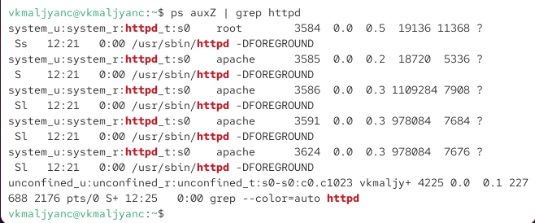{#fig-003 width=70%}

Смотрю текущее состояние переключателей SELinux для Apache с помощью команды sestatus -b httpd ([рис. @fig-004]).

{#fig-004 width=70%}

Смотрю статистику по политике с помощью команды seinfo, также определяю множество пользователей, ролей, типов ([рис. @fig-005]).

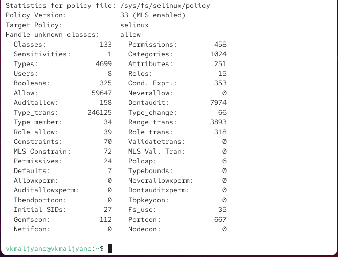{#fig-005 width=70%}

Определяю тип файлов и поддиректорий, находящихся в директории /var/www, с помощью команды ls -lZ /var/www ([рис. @fig-006]).

{#fig-006 width=70%}

Определяю тип файлов, находящихся в директории /var/www/html: ls -lZ /var/www/html ([рис. @fig-007]).

{#fig-007 width=70%}

Создаю от имени суперпользователя (так как в дистрибутиве после установки только ему разрешена запись в директорию) html-файл /var/www/html/test.html ([рис. @fig-008]) следующего содержания:

```
<html>
<body>test</body>
</html>
```

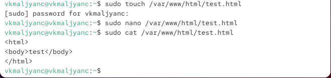{#fig-008 width=70%}

Проверяю контекст созданного мною файла ([рис. @fig-009]).

{#fig-009 width=70%}

Обращаюсь к файлу через веб-сервер, введя в браузере адрес http://127.0.0.1/test.html. Убеждаюсь, что файл был успешно отображён. ([рис. @fig-010]).

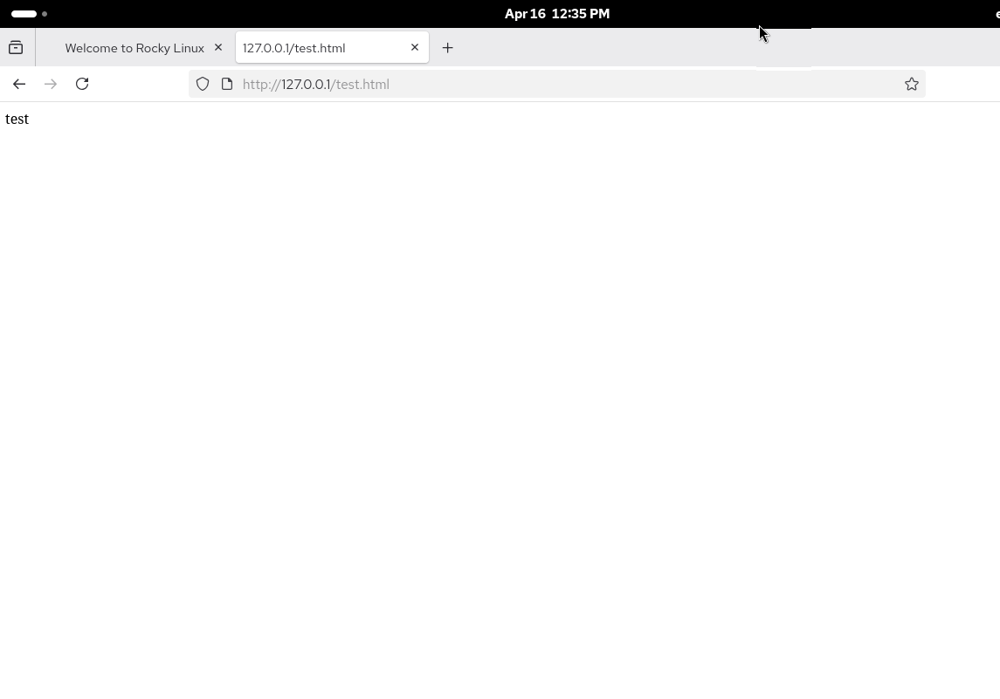{#fig-010 width=70%}

Изучаю справку man httpd selinux ([рис. @fig-011]).

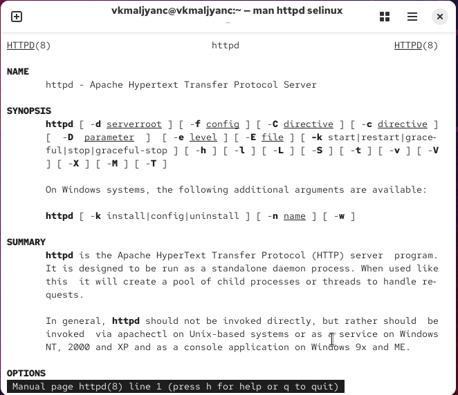{#fig-011 width=70%}

Изменяю контекст файла /var/www/html/test.html с httpd_sys_content_t на любой другой, к которому процесс httpd не должен иметь доступа, например, на samba_share_t: chcon -t samba_share_t /var/www/html/test.html
ls -Z /var/www/html/test.htm ([рис. @fig-012]).

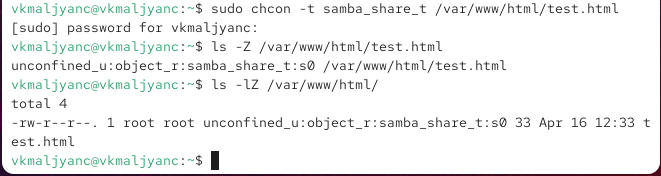{#fig-012 width=70%}

Пробую ещё раз получить доступ к файлу через веб-сервер, введя в браузере адрес http://127.0.0.1/test.html. Получила сообщение об ошибке ([рис. @fig-013]).

{#fig-013 width=70%}

Просматриваю log-файлы веб-сервера Apache. Также просматриваю системный лог-файл: tail /var/log/messages. Также просматриваю файл /var/log/audit/audit.log ([рис. @fig-014]).

{#fig-014 width=70%}

Пробую запустить веб-сервер Apache на прослушивание ТСР-порта 81 ([рис. @fig-015]).

{#fig-015 width=70%}

Произошел сбой ([рис. @fig-016]).

{#fig-016 width=70%}

Анализирую лог-файлы: tail -nl /var/log/messages. Просматриваю файлы /var/log/http/error_log, /var/log/http/access_log и /var/log/audit/audit.log ([рис. @fig-017]).

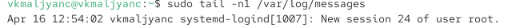{#fig-017 width=70%}

Просматриваю файл /var/log/http/error_log  ([рис. @fig-018]).

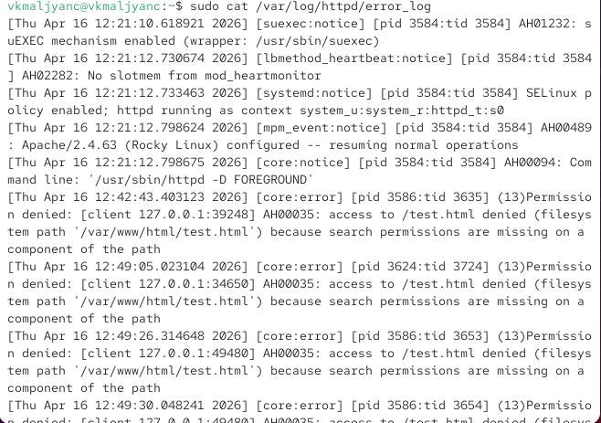{#fig-018 width=70%}

Просматриваю файл var/log/http/access_log  ([рис. @fig-019]).

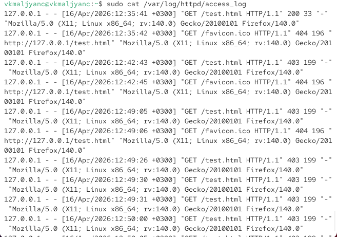{#fig-019 width=70%}

Просматриваю файл /var/log/audit/audit.log  ([рис. @fig-020]).

{#fig-020 width=70%}

Выполняю команду semanage port -a -t http_port_t -р tcp 81. После этого проверяю список портов командой semanage port -l | grep http_port_t
Убеждаюсь, что порт 81 появился в списке ([рис. @fig-021]).

{#fig-021 width=70%}

Перезапускаю веб-сервер Apache ([рис. @fig-022]).

{#fig-022 width=70%}

Возвращаю контекст httpd_sys_cоntent__t к файлу /var/www/html/ test.html: chcon -t httpd_sys_content_t /var/www/html/test.html ([рис. @fig-023]).

{#fig-023 width=70%}

Пробую получить доступ к файлу через веб-сервер, введя в браузере адрес http://127.0.0.1:81/test.html ([рис. @fig-024]).

{#fig-024 width=70%}

Исправляю обратно конфигурационный файл apache, вернув Listen 80 ([рис. @fig-025]).

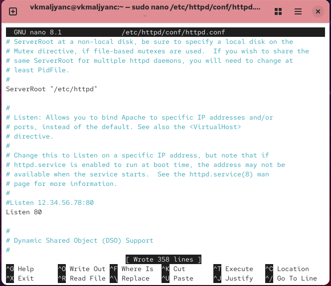{#fig-025 width=70%}

Удаляю привязку http_port_t к 81 порту: semanage port -d -t http_port_t -p tcp 81 и проверяю, что порт 81 удалён ([рис. @fig-026]).

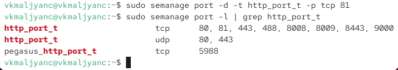{#fig-026 width=70%}

Удаляю файл /var/www/html/test.html: rm /var/www/html/test.html ([рис. @fig-027]) [@lab06].

{#fig-027 width=70%}

# Выводы

Я развила навыки администрирования ОС Linux. Получила первое практическое знакомство с технологией SELinux1. Проверила работу SELinux на практике совместно с веб-сервером Apache.

# Список литературы{.unnumbered}

::: {#refs}
:::
