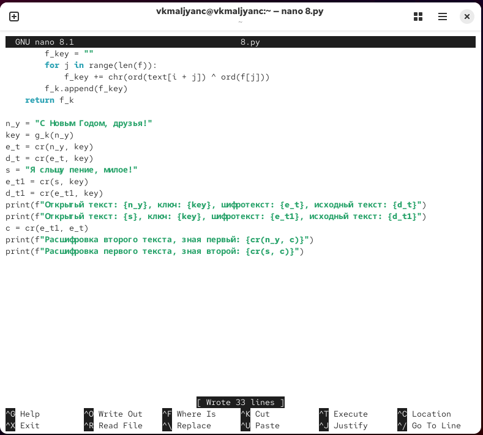
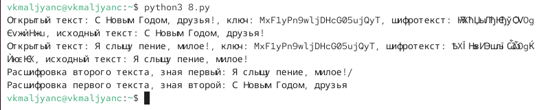

---
## Author
author:
  name: Мальянц Виктория Кареновна
  orcid: 0000-0002-0877-7063
  email: 1132246740@rudn.ru
  affiliation:
    - name: Российский университет дружбы народов
      country: Российская Федерация
      postal-code: 117198
      city: Москва
      address: ул. Миклухо-Маклая, д. 6
## Title
title: Лабораторная работа № 8
subtitle: Элементы криптографии. Шифрование (кодирование) различных исходных текстов одним ключом
license: CC BY
date: today
date-format: "YYYY-MM-DD" # Example: 2025-09-06
---

# Цель работы

- Освоить на практике применение режима однократного гаммирования на примере кодирования различных исходных текстов одним ключом.

# Задание

- Разработать приложение

# Выполнение лабораторной работы
## Разработать приложение

- Пишу программу, использую функцию для генерации ключа, затем шифрую два разных текста одним и тем же ключом, затем расшифровываю оба текста с помощью одного ключа, потом расшифровываю второй текст, зная шифротекст и первый текст (рис. 1).

{width=70%}

## Разработать приложение

- Проверяю работу программы. Успешно (рис. 2).

{width=70%}

# Выводы

- Я освоила на практике применение режима однократного гаммирования на примере кодирования различных исходных текстов одним ключом.

# Спасибо за внимание
