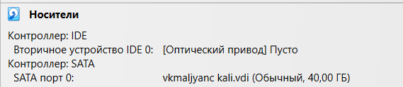

---
## Author
author:
  name: Мальянц Виктория Кареновна
  orcid: 0000-0002-0877-7063
  email: 1132246740@rudn.ru
  affiliation:
    - name: Российский университет дружбы народов
      country: Российская Федерация
      postal-code: 117198
      city: Москва
      address: ул. Миклухо-Маклая, д. 6
## Title
title: Индивидуальный проект этап № 1
subtitle: Установка дистрибутива Kali Linux на виртуальную машину VirtualBox
license: CC BY
date: today
date-format: "YYYY-MM-DD" # Example: 2025-09-06
---

# Цель работы

- Установить дистрибутив Kali Linux на виртуальную машину VirtualBox

# Задание

- Установить дистрибутив Kali Linux на виртуальную машину VirtualBox

# Выполнение лабораторной работы
## Установить дистрибутив Kali Linux на виртуальную машину VirtualBox

- Скачала образ диска (рис. 1).

{width=70%}

## Установить дистрибутив Kali Linux на виртуальную машину VirtualBox

- Выбираю имя и тип ОС (рис. 2).

{width=70%}

## Установить дистрибутив Kali Linux на виртуальную машину VirtualBox

- Выбираю графическую установку (рис. 3).

{width=70%}

## Установить дистрибутив Kali Linux на виртуальную машину VirtualBox

- Выбираю русский язык, на нем буду устанавливать (рис. 4).

{width=70%}

## Установить дистрибутив Kali Linux на виртуальную машину VirtualBox

- Выбираю местоположение (рис. 5).

{width=70%}

## Установить дистрибутив Kali Linux на виртуальную машину VirtualBox

- Настраиваю клавиатуру (рис. 6).

{width=70%}

## Установить дистрибутив Kali Linux на виртуальную машину VirtualBox

- Указываю способ переключения клавиатуры (рис. 7).

{width=70%}

## Установить дистрибутив Kali Linux на виртуальную машину VirtualBox

- Ввожу имя пользователя (рис. 8).

{width=70%}

## Установить дистрибутив Kali Linux на виртуальную машину VirtualBox

- Ввожу имя домена (рис. 9).

{width=70%}

## Установить дистрибутив Kali Linux на виртуальную машину VirtualBox

- Ввожу полное имя нового пользователя (рис. 10).

{width=70%}

## Установить дистрибутив Kali Linux на виртуальную машину VirtualBox

- Выбираю имя учетной записи (рис. 11).

{width=70%}

## Установить дистрибутив Kali Linux на виртуальную машину VirtualBox

- Создаю пароль (рис. 12).

{width=70%}

## Установить дистрибутив Kali Linux на виртуальную машину VirtualBox

- Настраиваю время (рис. 13).

{width=70%}

## Установить дистрибутив Kali Linux на виртуальную машину VirtualBox

- Выбираю метод разметки (рис. 14).

{width=70%}

## Установить дистрибутив Kali Linux на виртуальную машину VirtualBox

- Выбираю диск для разметки (рис. 15).

{width=70%}

## Установить дистрибутив Kali Linux на виртуальную машину VirtualBox

- Выбираю схему разметки (рис. 16).

{width=70%}

## Установить дистрибутив Kali Linux на виртуальную машину VirtualBox

- Заканчиваю разметку и записываю изменения на диск (рис. 17).

{width=70%}

## Установить дистрибутив Kali Linux на виртуальную машину VirtualBox

- Записываю изменения на диск (рис. 18).

{width=70%}

## Установить дистрибутив Kali Linux на виртуальную машину VirtualBox

- Выбираю программное обеспечение (рис. 19).

{width=70%}

## Установить дистрибутив Kali Linux на виртуальную машину VirtualBox

- Устанавливаю системный загрузчик GRUB на первичный диск (рис. 20).

{width=70%}

## Установить дистрибутив Kali Linux на виртуальную машину VirtualBox

- Указываю устройство установки системного загрузчика (рис. 21).

{width=70%}

## Установить дистрибутив Kali Linux на виртуальную машину VirtualBox

- Вхожу в учетную запись (рис. 22).

{width=70%}

## Установить дистрибутив Kali Linux на виртуальную машину VirtualBox

- В носителях теперь пусто (рис. 23).

{width=70%}

## Установить дистрибутив Kali Linux на виртуальную машину VirtualBox

- Загрузка и вход в систему выполнены успешно (рис. 24).

{width=70%}

# Выводы

- Я установила дистрибутив Kali Linux на виртуальную машину VirtualBox.

# Спасибо за внимание
