---
## Author
author:
  name: Мальянц Виктория Кареновна
  orcid: 0000-0002-0877-7063
  email: 1132246740@rudn.ru
  affiliation:
    - name: Российский университет дружбы народов
      country: Российская Федерация
      postal-code: 117198
      city: Москва
      address: ул. Миклухо-Маклая, д. 6

## Title
title: "Индивидуальный проект этап № 1"
subtitle: "Установка дистрибутива Kali Linux на виртуальную машину VirtualBox"
license: "CC BY"
---

# Цель работы

Установить дистрибутив Kali Linux на виртуальную машину VirtualBox.

# Задание

1. Установить дистрибутив Kali Linux на виртуальную машину VirtualBox

# Выполнение лабораторной работы
## Установить дистрибутив Kali Linux на виртуальную машину VirtualBox

Скачала образ диска ([рис. @fig-001]).

{#fig-001 width=70%}

Выбираю имя и тип ОС ([рис. @fig-002]).

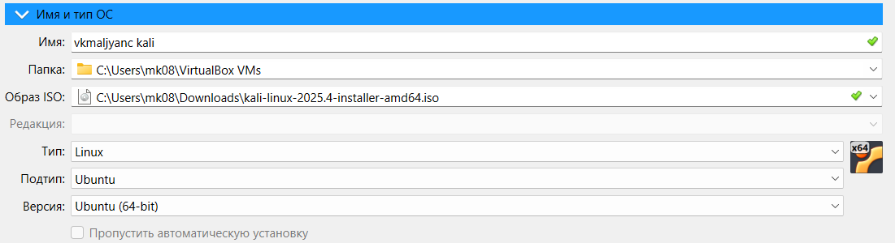{#fig-002 width=70%}

Выбираю графическую установку ([рис. @fig-003]).

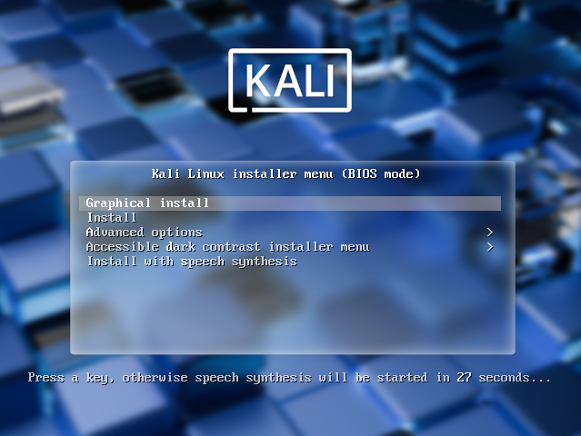{#fig-003 width=70%}

Выбираю русский язык, на нем буду устанавливать ([рис. @fig-004]).

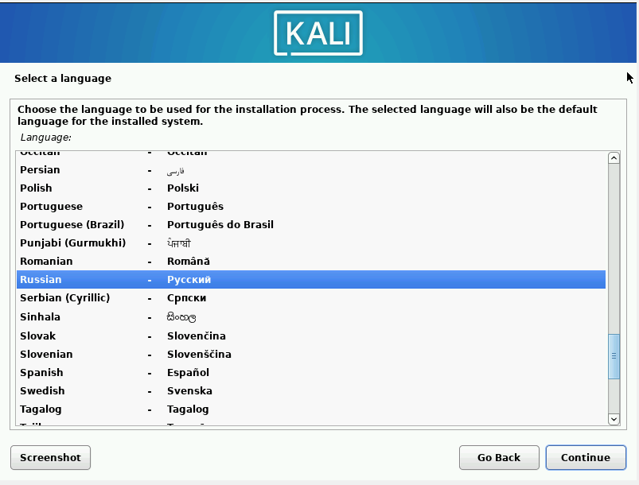{#fig-004 width=70%}

Выбираю местоположение ([рис. @fig-005]).

{#fig-005 width=70%}

Настраиваю клавиатуру ([рис. @fig-006]).

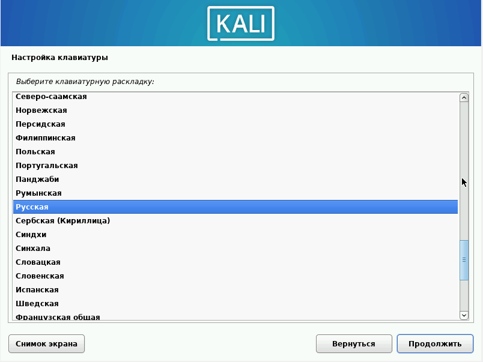{#fig-006 width=70%}

Указываю способ переключения клавиатуры ([рис. @fig-007]).

{#fig-007 width=70%}

Ввожу имя пользователя ([рис. @fig-008]).

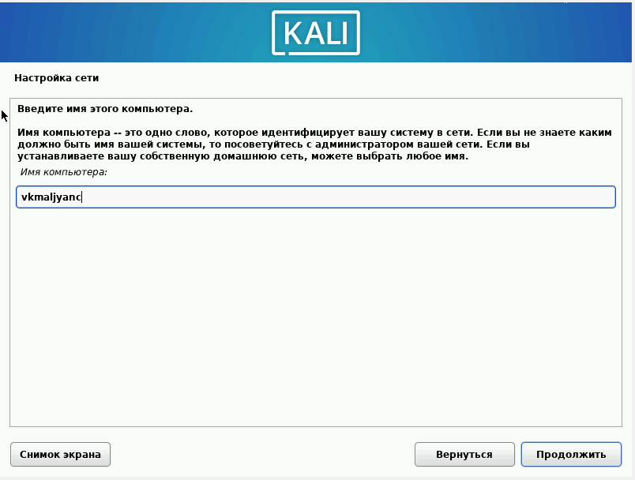{#fig-008 width=70%}

Ввожу имя домена ([рис. @fig-009]).

{#fig-009 width=70%}

Ввожу полное имя нового пользователя ([рис. @fig-010]).

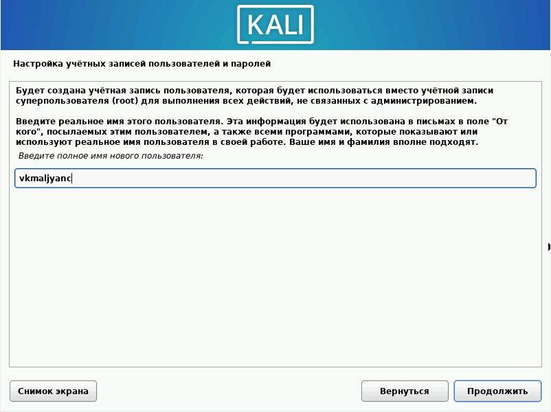{#fig-010 width=70%}

Выбираю имя учетной записи ([рис. @fig-011]).

{#fig-011 width=70%}

Создаю пароль ([рис. @fig-012]).

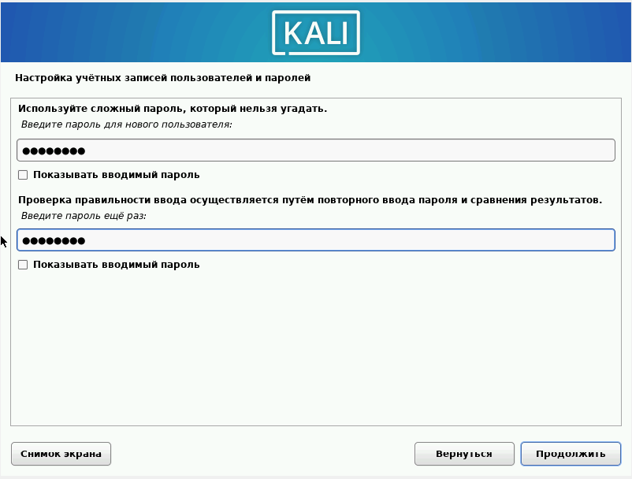{#fig-012 width=70%}

Настраиваю время ([рис. @fig-013]).

{#fig-013 width=70%}

Выбираю метод разметки ([рис. @fig-014]).

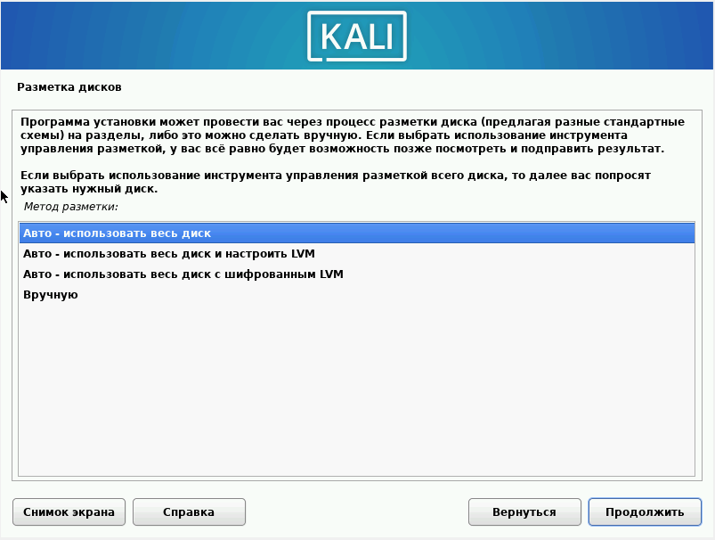{#fig-014 width=70%}

Выбираю диск для разметки ([рис. @fig-015]).

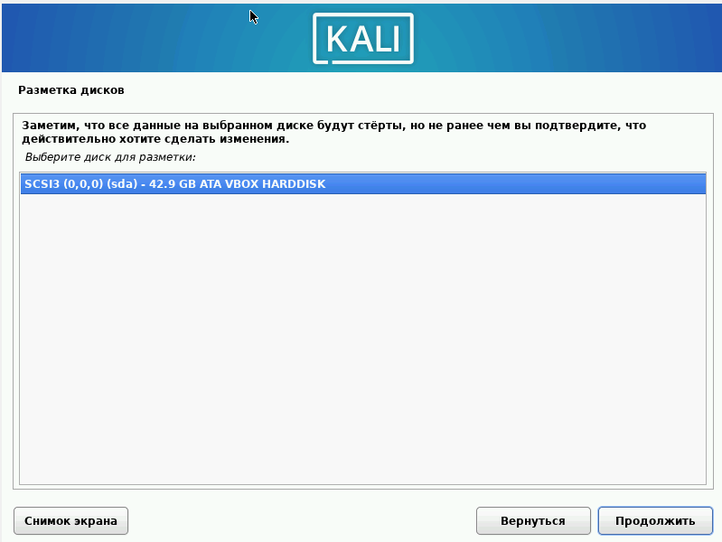{#fig-015 width=70%}

Выбираю схему разметки ([рис. @fig-016]).

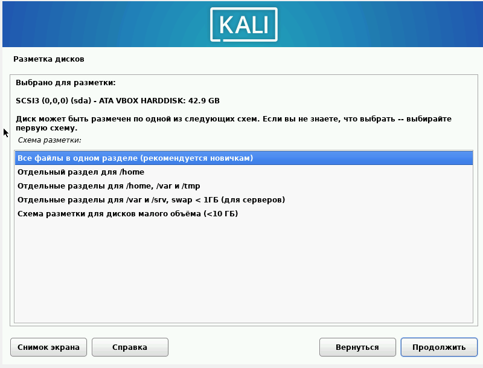{#fig-016 width=70%}

Заканчиваю разметку и записываю изменения на диск ([рис. @fig-017]).

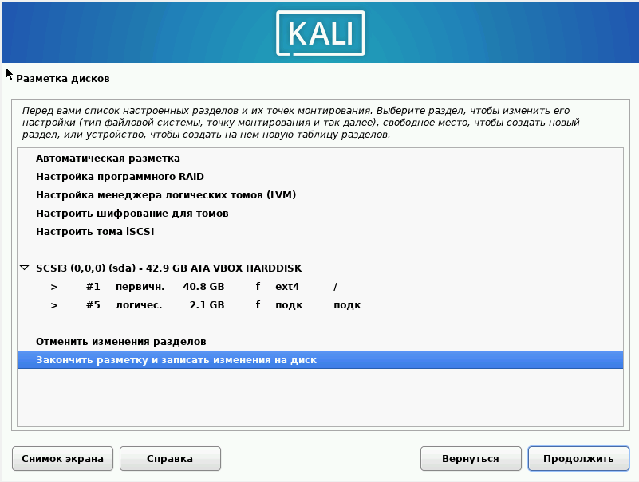{#fig-017 width=70%}

Записываю изменения на диск ([рис. @fig-018]).

{#fig-018 width=70%}

Выбираю программное обеспечение ([рис. @fig-019]).

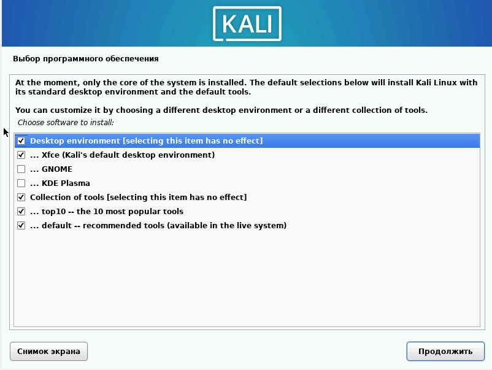{#fig-019 width=70%}

Устанавливаю системный загрузчик GRUB на первичный диск ([рис. @fig-020]).

{#fig-020 width=70%}

Указываю устройство установки системного загрузчика ([рис. @fig-021]).

{#fig-021 width=70%}

Вхожу в учетную запись ([рис. @fig-022]).

{#fig-022 width=70%}

В носителях теперь пусто ([рис. @fig-023]).

{#fig-023 width=70%}

Загрузка и вход в систему выполнены успешно ([рис. @fig-024]) [@Индивидуальный_проект_этап_1].

{#fig-024 width=70%}

# Выводы

Я установила дистрибутив Kali Linux на виртуальную машину VirtualBox.

# Список литературы{.unnumbered}

::: {#refs}
:::
