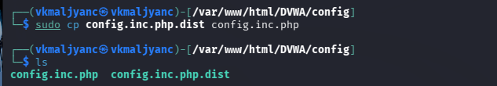
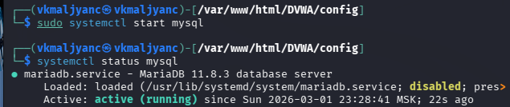
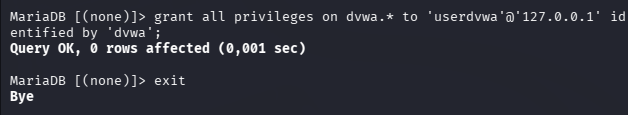
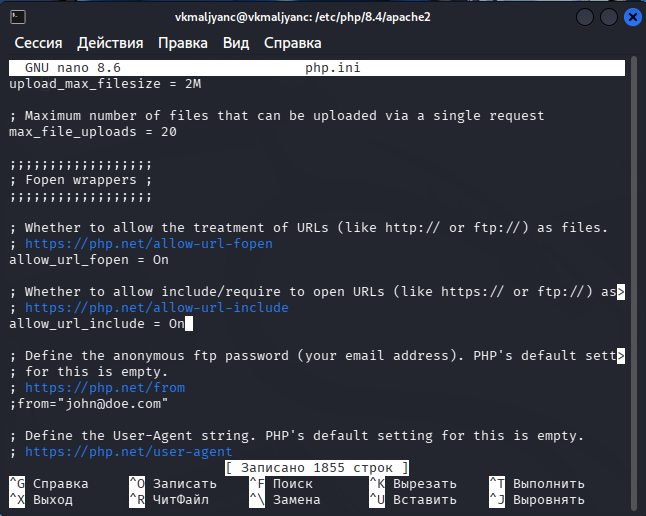
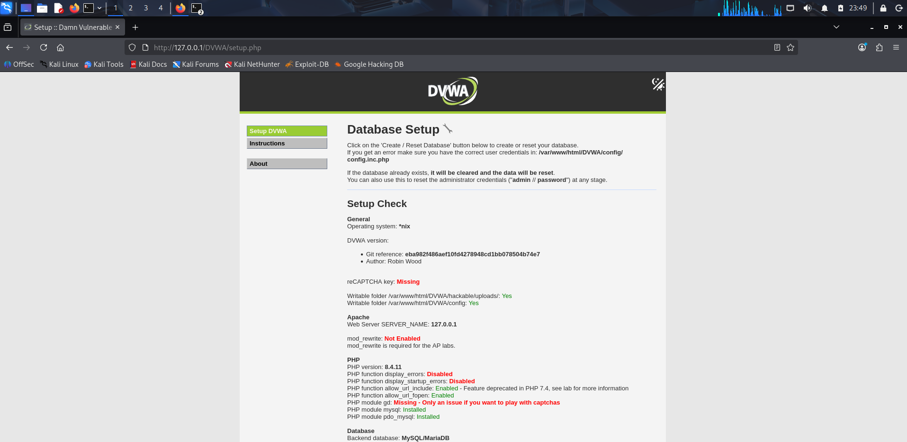
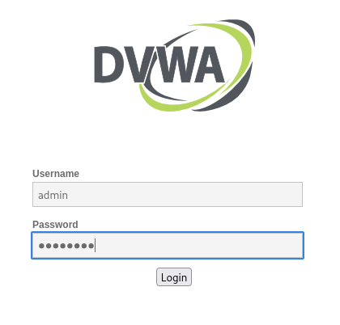

---
## Author
author:
  name: Мальянц Виктория Кареновна
  orcid: 0000-0002-0877-7063
  email: 1132246740@rudn.ru
  affiliation:
    - name: Российский университет дружбы народов
      country: Российская Федерация
      postal-code: 117198
      city: Москва
      address: ул. Миклухо-Маклая, д. 6
## Title
title: Индивидуальный проект этап № 2
subtitle: Установка DVWA
license: CC BY
date: today
date-format: "YYYY-MM-DD" # Example: 2026-03-02
---

# Цель работы

- Приобретение практических навыков по установке DVWA.

# Задание

- Установить DVWA на дистрибутив Kali Linux

# Выполнение лабораторной работы
## Установить DVWA на дистрибутив Kali Linux

- Перехожу в директорию /var/www/html, после этого клонирую нужный репозиторий GitHub (рис. 1).

{width=70%}

## Установить DVWA на дистрибутив Kali Linux

- Убеждаюсь в успешном клонировании репозитория и повышаю права доступа к этой директории до 777 (рис. 2).

{width=70%}

## Установить DVWA на дистрибутив Kali Linux

- Перехожу в каталог DVWA/config и просматриваю его содержимое (рис. 3).

{width=70%}

## Установить DVWA на дистрибутив Kali Linux

- Копирую файл config.inc.php.dist с именем config.inc.php (рис. 4).
 
{width=70%}

## Установить DVWA на дистрибутив Kali Linux

- Открываю в текстовом редакторе nano файл config.inc.php (рис. 5).

{width=70%}

## Установить DVWA на дистрибутив Kali Linux

- Редактирую файл config.inc.php, изменяю данные об имени пользователя и пароле (рис. 6).

{width=70%}

## Установить DVWA на дистрибутив Kali Linux

- Запускаю mysql и выполняю проверку, чтобы узнать, запущен ли процесс (рис. 7).

{width=70%}

## Установить DVWA на дистрибутив Kali Linux

- Авторизуюсь в базе данных от имени пользователя root, создаю нового пользователя в командной строке с приглашением "MariaDB", используя данные из config.inc.php (рис. 8).

{width=70%}

## Установить DVWA на дистрибутив Kali Linux

- Предоставляю пользователю привилегии для работы с этой базой данных (рис. 9).

{width=70%}

## Установить DVWA на дистрибутив Kali Linux

- Перехожу в директорию /etc/php/8.4/apache2 (рис. 10).

{width=70%}

## Установить DVWA на дистрибутив Kali Linux

- Открываю в текстовом редакторе nano файл php.ini (рис. 11).

{width=70%}

## Установить DVWA на дистрибутив Kali Linux

- Ставлю параметры allow_url_fopen и allow_url_include как On (рис. 12).

{width=70%}

## Установить DVWA на дистрибутив Kali Linux

- Запускаю службу веб-сервера apache и проверяю, запущена ли служба (рис. 13).

{width=70%}

## Установить DVWA на дистрибутив Kali Linux

- Я настроила DVWA, базу данных и Apache. Открываю браузер и запускаю веб-приложение, введя 127.0.0.1.DVWA (рис. 14).

{width=70%}

## Установить DVWA на дистрибутив Kali Linux

- Нажимаю на кнопку Create / Reset Database (рис. 15).

{width=70%}

## Установить DVWA на дистрибутив Kali Linux

- Авторизуюсь с помощью предложенных по умолчанию данных (рис. 16).

{width=70%}

## Установить DVWA на дистрибутив Kali Linux

- Оказываюсь на домашней странице веб-приложения (рис. 17).

{width=70%}

# Выводы

- Я приобрела практические навыки по установке DVWA.

# Спасибо за внимание
