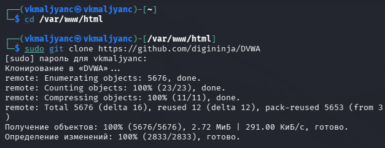
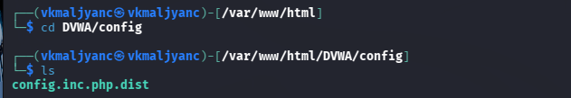
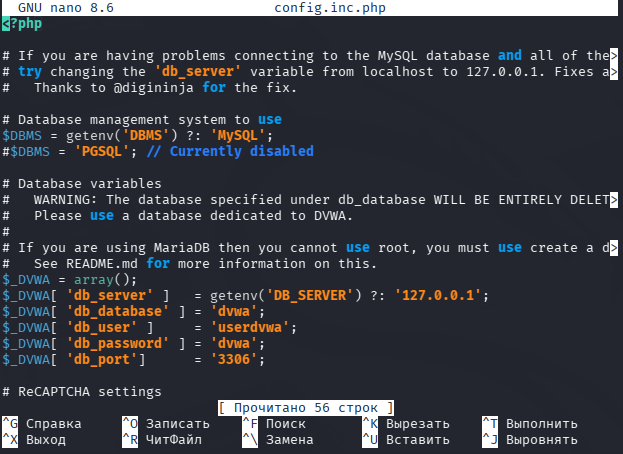
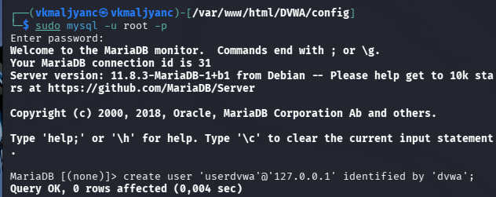
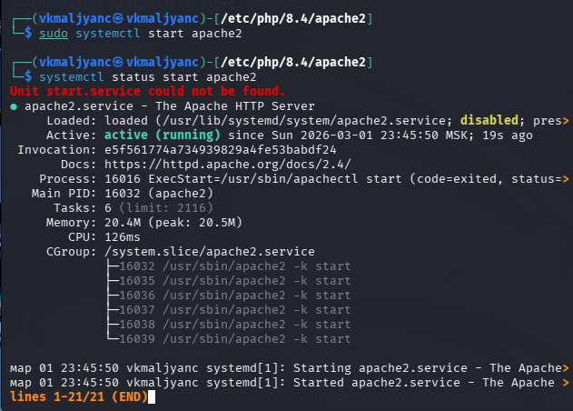
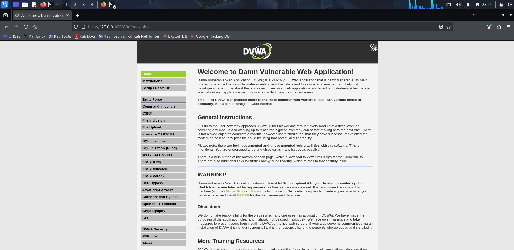

---
## Author
author:
  name: Мальянц Виктория Кареновна
  orcid: 0000-0002-0877-7063
  email: 1132246740@rudn.ru
  affiliation:
    - name: Российский университет дружбы народов
      country: Российская Федерация
      postal-code: 117198
      city: Москва
      address: ул. Миклухо-Маклая, д. 6

## Title
title: "Индивидуальный проект этап № 2"
subtitle: "Установка DVWA"
license: "CC BY"
---

# Цель работы

Приобретение практических навыков по установке DVWA.

# Задание

1. Установить DVWA на дистрибутив Kali Linux

# Выполнение лабораторной работы
## Установить DVWA на дистрибутив Kali Linux

Перехожу в директорию /var/www/html, после этого клонирую нужный репозиторий GitHub ([рис. @fig-001]).

{#fig-001 width=70%}

Убеждаюсь в успешном клонировании репозитория и повышаю права доступа к этой директории до 777 ([рис. @fig-002]).

{#fig-002 width=70%}

Перехожу в каталог DVWA/config и просматриваю его содержимое ([рис. @fig-003]).

{#fig-003 width=70%}

Копирую файл config.inc.php.dist с именем config.inc.php ([рис. @fig-004]).
 
{#fig-004 width=70%}

Открываю в текстовом редакторе nano файл config.inc.php ([рис. @fig-005]).

{#fig-005 width=70%}

Редактирую файл config.inc.php, изменяю данные об имени пользователя и пароле ([рис. @fig-006]).

{#fig-006 width=70%}

Запускаю mysql и выполняю проверку, чтобы узнать, запущен ли процесс ([рис. @fig-007]).

{#fig-007 width=70%}

Авторизуюсь в базе данных от имени пользователя root, создаю нового пользователя в командной строке с приглашением "MariaDB", используя данные из config.inc.php ([рис. @fig-008]).

{#fig-008 width=70%}

Предоставляю пользователю привилегии для работы с этой базой данных ([рис. @fig-009]).

{#fig-009 width=70%}

Перехожу в директорию /etc/php/8.4/apache2 ([рис. @fig-010]).

{#fig-010 width=70%}

Открываю в текстовом редакторе nano файл php.ini ([рис. @fig-011]).

{#fig-011 width=70%}

Ставлю параметры allow_url_fopen и allow_url_include как On ([рис. @fig-012]).

{#fig-012 width=70%}

Запускаю службу веб-сервера apache и проверяю, запущена ли служба ([рис. @fig-013]).

{#fig-013 width=70%}

Я настроила DVWA, базу данных и Apache. Открываю браузер и запускаю веб-приложение, введя 127.0.0.1.DVWA ([рис. @fig-014]).

{#fig-014 width=70%}

Нажимаю на кнопку Create / Reset Database ([рис. @fig-015]).

{#fig-015 width=70%}

Авторизуюсь с помощью предложенных по умолчанию данных ([рис. @fig-016]).

{#fig-016 width=70%}

Оказываюсь на домашней странице веб-приложения ([рис. @fig-017]) [@Индивидуальный_проект_этап_2].

{#fig-017 width=70%}

# Выводы

Я приобрела практические навыки по установке DVWA.

# Список литературы{.unnumbered}

::: {#refs}
:::
