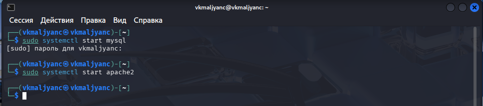
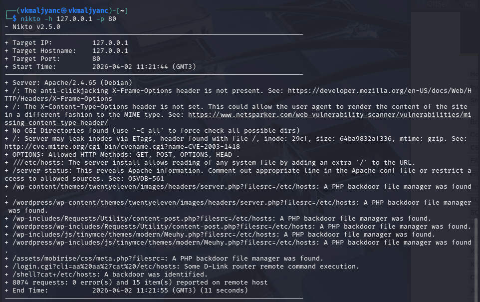

---
## Author
author:
  name: Мальянц Виктория Кареновна
  orcid: 0000-0002-0877-7063
  email: 1132246740@rudn.ru
  affiliation:
    - name: Российский университет дружбы народов
      country: Российская Федерация
      postal-code: 117198
      city: Москва
      address: ул. Миклухо-Маклая, д. 6
## Title
title: Индивидуальный проект этап № 4
subtitle: Использование nikto
license: CC BY
date: today
date-format: "2026-04-02" # Example: 2025-09-06
---

# Цель работы

- Приобретение практических навыков по использованию nikto.

# Задание

- Приобретение практических навыков по использованию nikto

# Выполнение лабораторной работы
## Приобретение практических навыков по использованию nikto

- Запускаю mysql и apache2 (рис. 1).

{width=70%}

## Приобретение практических навыков по использованию nikto

- Открываю DVWA и меняю уровень безопасности на Low (рис. 2).

{width=70%}

## Приобретение практических навыков по использованию nikto

- Запускаю nikto (рис. 3).

{width=70%}

## Приобретение практических навыков по использованию nikto

- Проверяю веб-приложение, сканирую его, введя его полный URL (рис. 4).

{width=70%}

## Приобретение практических навыков по использованию nikto

- Проверяю веб-приложение, сканирую его, введя адрес хоста и адрес порта (рис. 5).

{width=70%}

# Выводы

- Я приобрела практические навыки по использованию nikto.

# Спасибо за внимание
