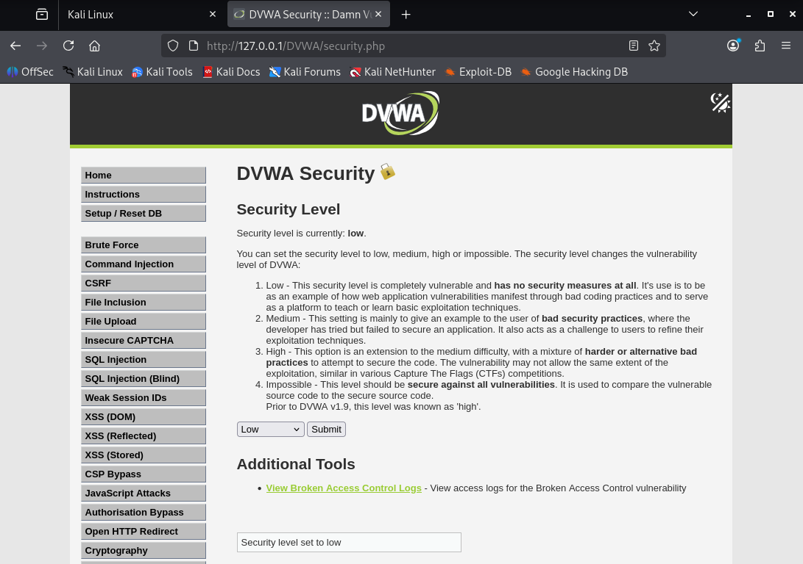
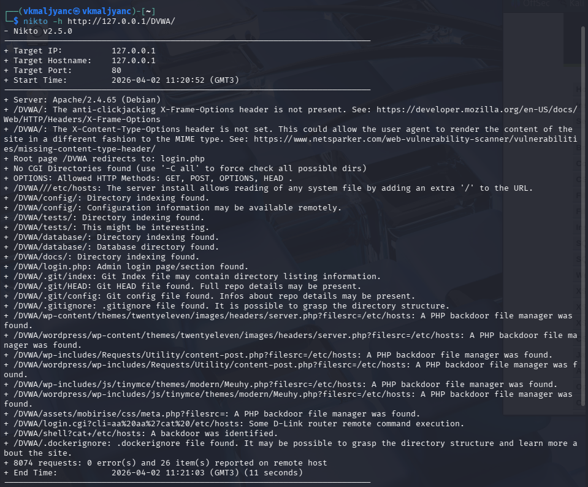

---
## Author
author:
  name: Мальянц Виктория Кареновна
  orcid: 0000-0002-0877-7063
  email: 1132246740@rudn.ru
  affiliation:
    - name: Российский университет дружбы народов
      country: Российская Федерация
      postal-code: 117198
      city: Москва
      address: ул. Миклухо-Маклая, д. 6

## Title
title: "Индивидуальный проект этап № 4"
subtitle: "Использование nikto"
license: "CC BY"
---

# Цель работы

Приобретение практических навыков по использованию nikto.

# Задание

1. Приобретение практических навыков по использованию nikto

# Выполнение лабораторной работы
## Приобретение практических навыков по использованию nikto

Запускаю mysql и apache2 ([рис. @fig-001]).

{#fig-001 width=70%}

Открываю DVWA и меняю уровень безопасности на Low ([рис. @fig-002]).

{#fig-002 width=70%}

Запускаю nikto ([рис. @fig-003]).

{#fig-003 width=70%}

Проверяю веб-приложение, сканирую его, введя его полный URL ([рис. @fig-004]).

{#fig-004 width=70%}

Проверяю веб-приложение, сканирую его, введя адрес хоста и адрес порта ([рис. @fig-005]) [@Индивидуальный_проект_этап_4].

{#fig-005 width=70%}

# Выводы

Я приобрела практические навыки по использованию nikto.

# Список литературы{.unnumbered}

::: {#refs}
:::
