---
## Author
author:
  name: Мальянц Виктория Кареновна
  orcid: 0000-0002-0877-7063
  email: 1132246740@rudn.ru
  affiliation:
    - name: Российский университет дружбы народов
      country: Российская Федерация
      postal-code: 117198
      city: Москва
      address: ул. Миклухо-Маклая, д. 6
## Title
title: Индивидуальный проект этап № 5
subtitle: Использование Burp Suite
license: CC BY
date: today
date-format: "YYYY-MM-DD" # Example: 2025-09-06
---

# Цель работы

- Приобретение практических навыков по использованию Burp Suite.

# Задание

- Приобретение практических навыков по использованию Burp Suite

# Выполнение лабораторной работы
## Приобретение практических навыков по использованию Burp Suite

- Запускаю apache2 и mysql (рис. 1).

{width=70%}

## Приобретение практических навыков по использованию Burp Suite

- Запускаю Burp Suite (рис. 2).

{width=70%}

## Приобретение практических навыков по использованию Burp Suite

- Открываю сетевые настройки браузера (рис. 3).

{width=70%}

## Приобретение практических навыков по использованию Burp Suite

- Изменяю настройки сервера для работы с proxy и захватом данных с помощью инструмента Burp Suite (рис. 4).

{width=70%}

## Приобретение практических навыков по использованию Burp Suite

- Изменяю настройки Proxy инструмента Burp Suite (рис. 5).

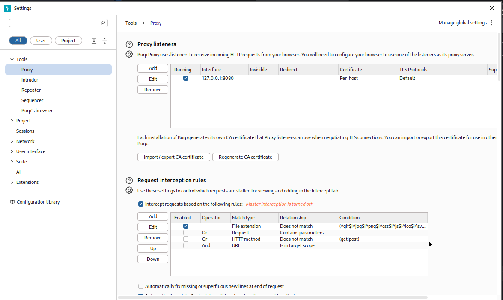{width=70%}

## Приобретение практических навыков по использованию Burp Suite

- Во вкладке Proxy устанавливаю Intercept on (рис. 6).

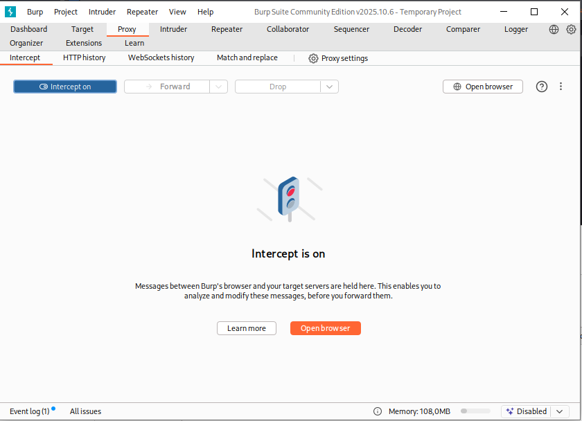{width=70%}

## Приобретение практических навыков по использованию Burp Suite

- Устанавливаю параметр network.proxy.allow_hijacking_localhost на true (рис. 7).

{width=70%}

## Приобретение практических навыков по использованию Burp Suite

- Запускаю страницу в браузере, запрос виден в Burp Suite (рис. 8).

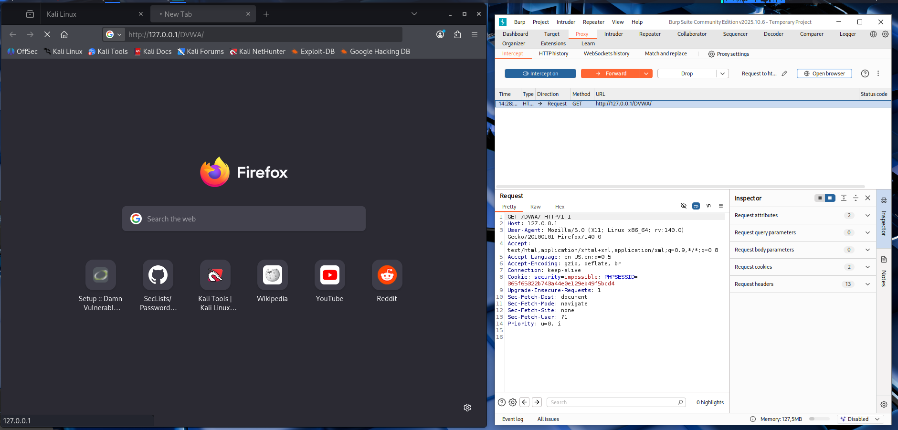{width=70%}

## Приобретение практических навыков по использованию Burp Suite

- Загружаю страницу с помощью Forward (рис. 9).

{width=70%}

## Приобретение практических навыков по использованию Burp Suite

- Во вкладке Target сохраняется история запросов (рис. 10).

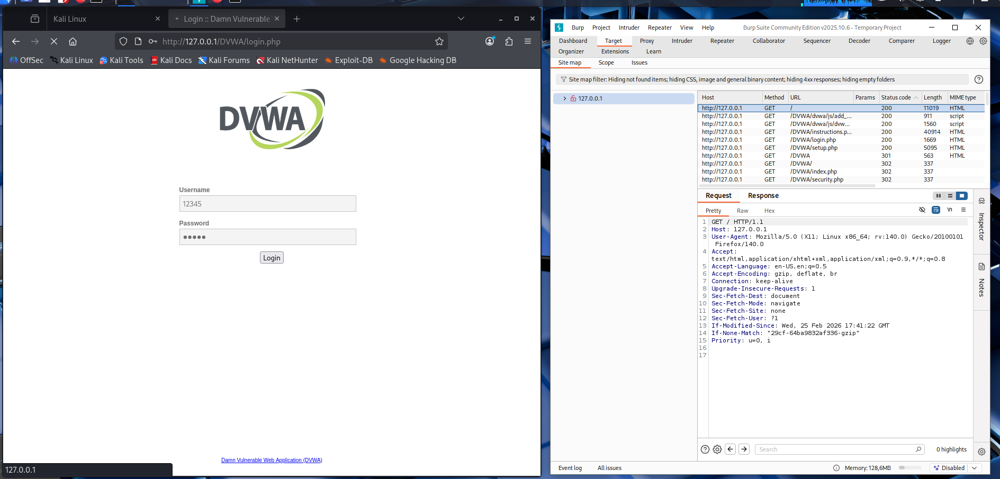{width=70%}

## Приобретение практических навыков по использованию Burp Suite

- Нажимаю на запрос и далее на кнопку Send to intruder (рис. 11).

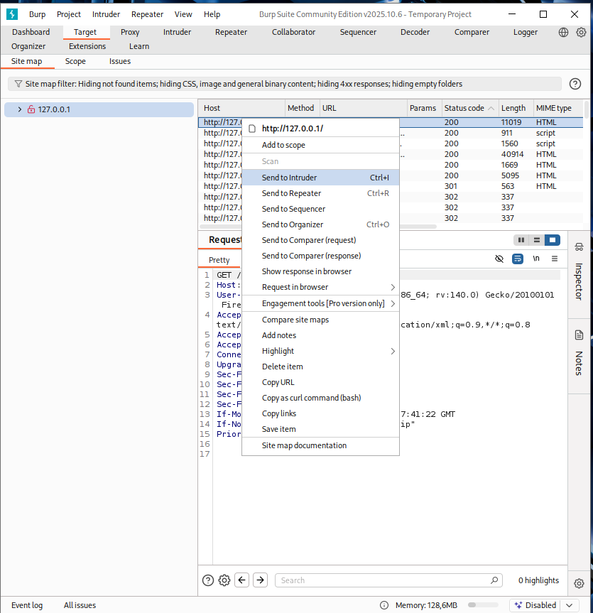{width=70%}

## Приобретение практических навыков по использованию Burp Suite

- Во вкладке Intruder меняю тип атаки на Cluster bomb attack и выделяю специальными символами данные в форме для ввода (рис. 12).

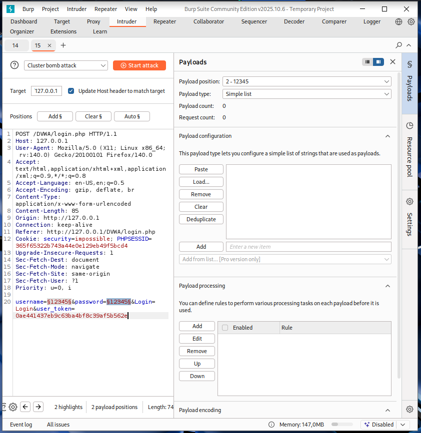{width=70%}

## Приобретение практических навыков по использованию Burp Suite

- Добавляю значения в список для подбора у Payload position: 1 - 12345 (рис. 13).

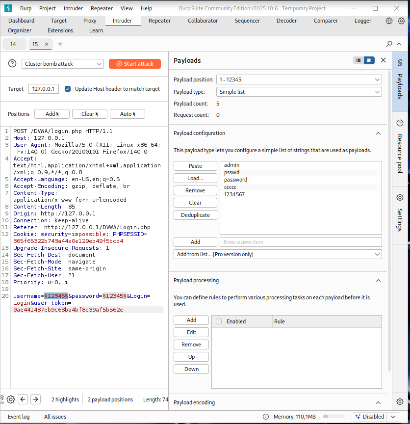{width=70%}

## Приобретение практических навыков по использованию Burp Suite

- Добавляю значения в список для подбора у Payload position: 2 - 12345 (рис. 14).

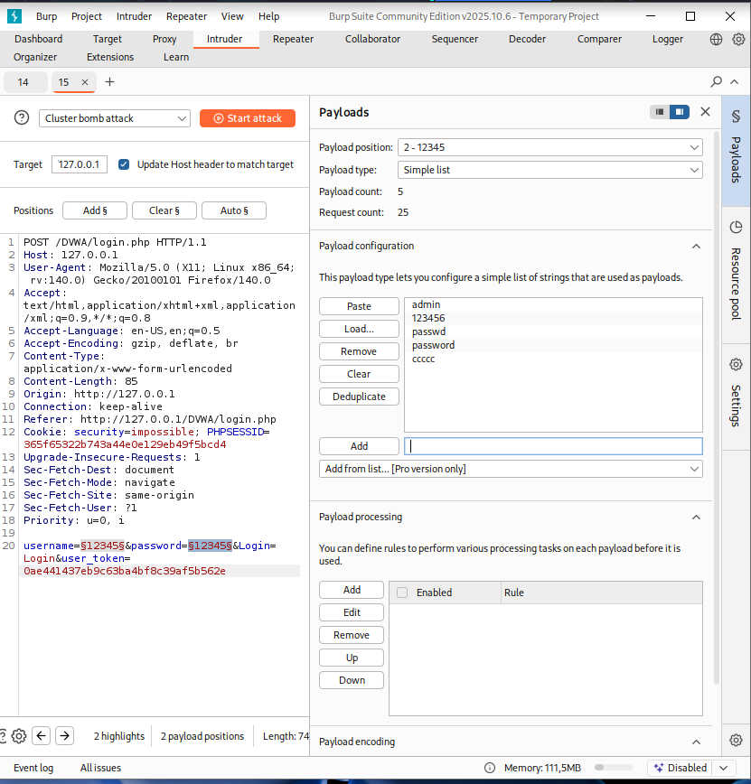{width=70%}

## Приобретение практических навыков по использованию Burp Suite

- Запускаю атаку. Выбираю комбинацию 1234567 admin. У нее Location: login.php, значит она не подходит (рис. 15).

{width=70%}

## Приобретение практических навыков по использованию Burp Suite

- Выбираю комбинацию admin password. У нее Location: index.php, значит она подходит (рис. 16).

{width=70%}

## Приобретение практических навыков по использованию Burp Suite

- Нажимаю на комбинацию admin password и далее на кнопку Send to Repeater (рис. 17).

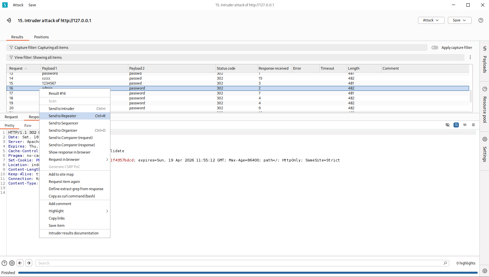{width=70%}

## Приобретение практических навыков по использованию Burp Suite

- Во вкладке Repeater нажимаю на кнопку Follow redirection (рис. 18).

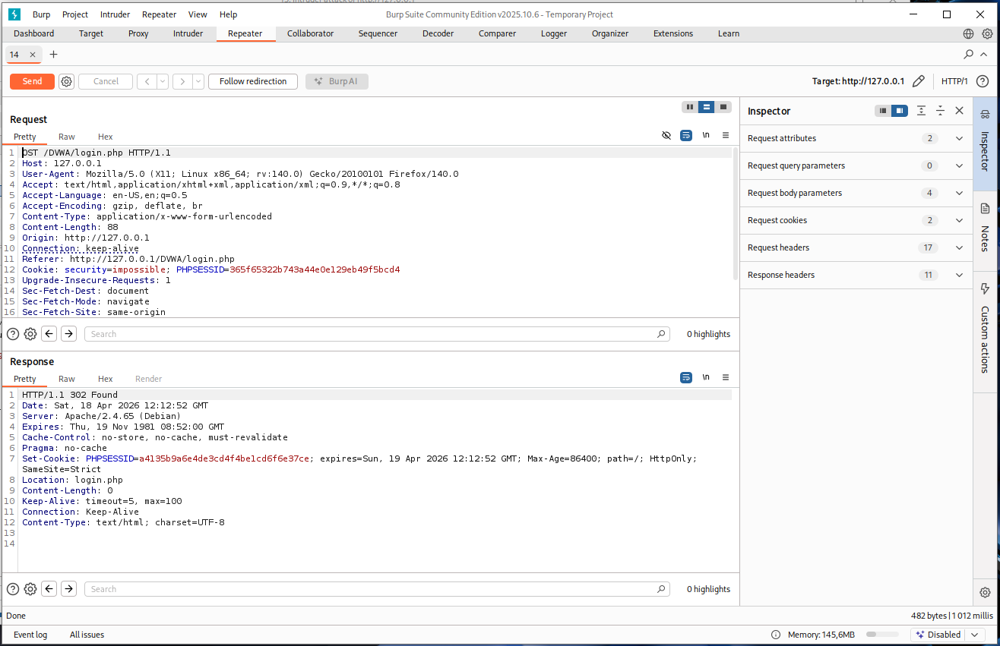{width=70%}

## Приобретение практических навыков по использованию Burp Suite

- Нажимаю на Request in browser, далее на In original session (рис. 19).

{width=70%}

## Приобретение практических навыков по использованию Burp Suite

- Копирую ссылку на страницу (рис. 20).

{width=70%}

## Приобретение практических навыков по использованию Burp Suite

- Вставляю ссылку в браузер, страница открылась (рис. 21).

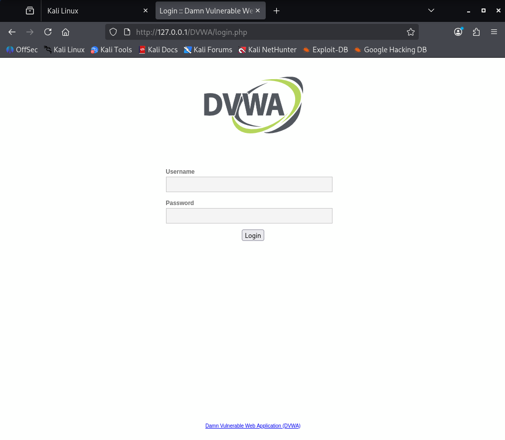{width=70%}

# Выводы

- Я приобрела практические навыки по использованию Burp Suite.

# Спасибо за внимание
