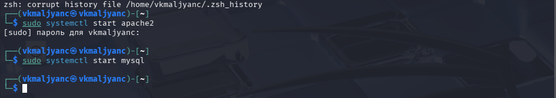
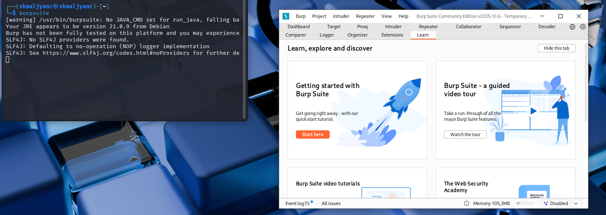
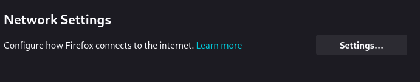
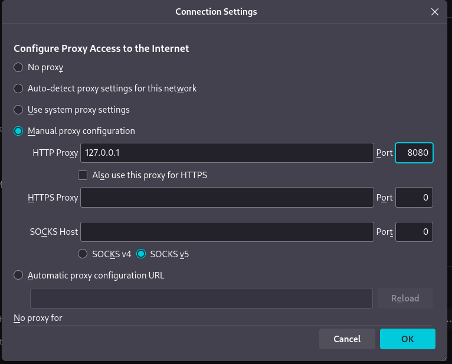
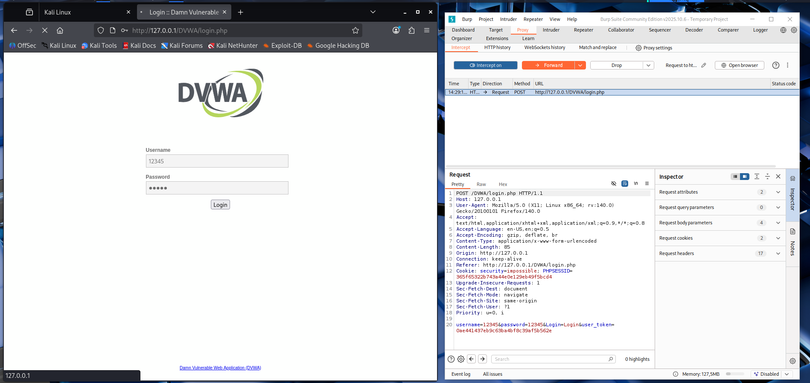
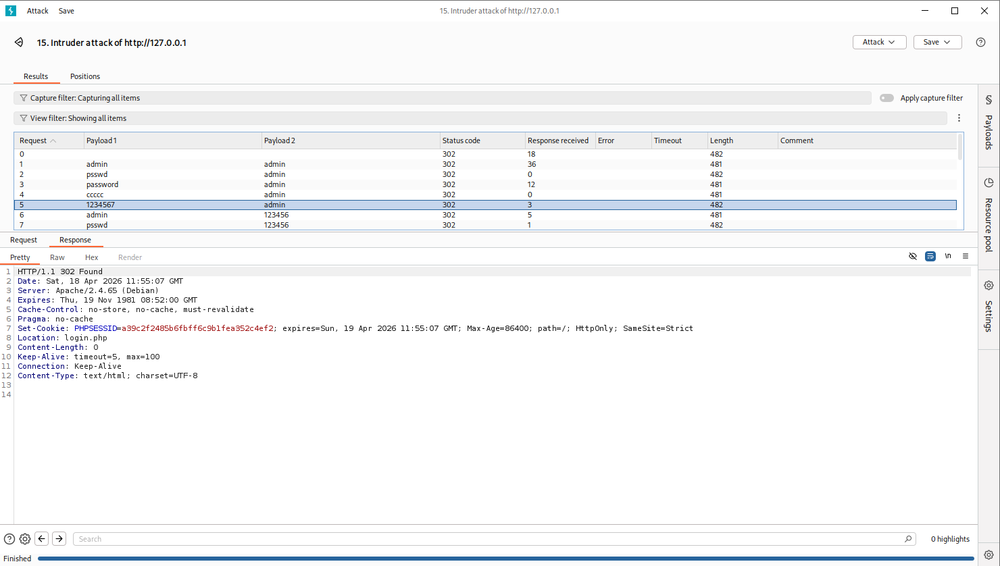
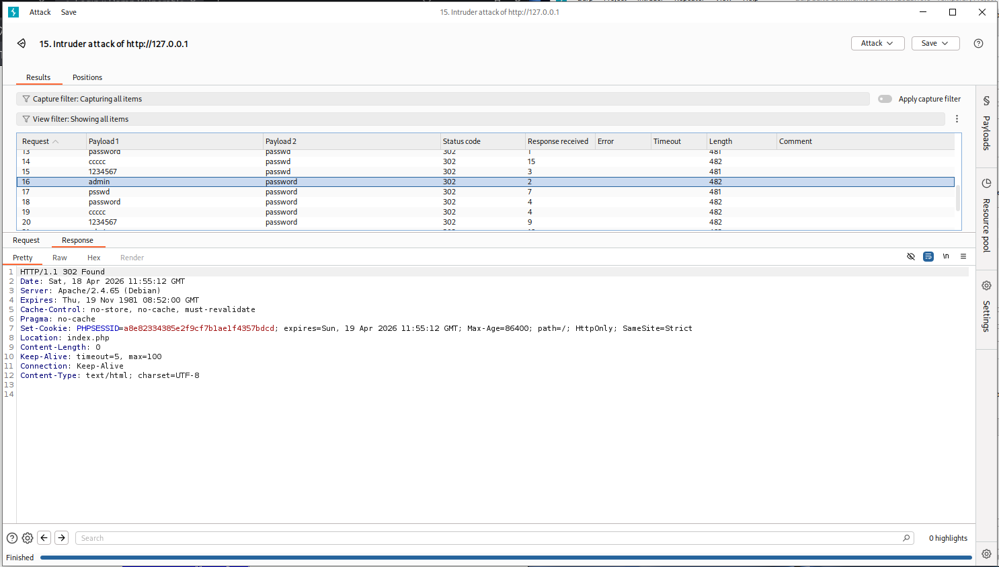
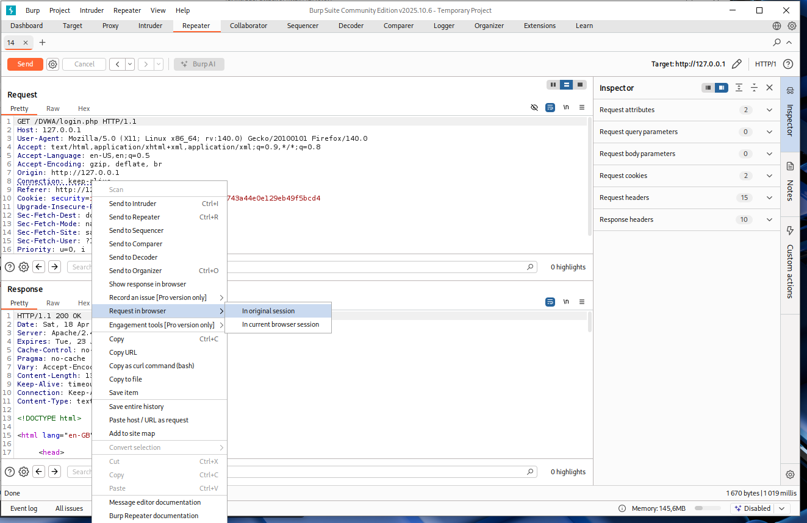
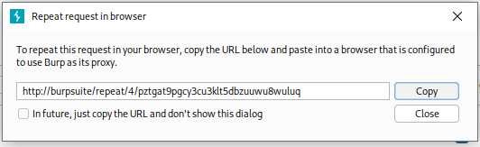

---
## Author
author:
  name: Мальянц Виктория Кареновна
  orcid: 0000-0002-0877-7063
  email: 1132246740@rudn.ru
  affiliation:
    - name: Российский университет дружбы народов
      country: Российская Федерация
      postal-code: 117198
      city: Москва
      address: ул. Миклухо-Маклая, д. 6

## Title
title: "Индивидуальный проект этап № 5"
subtitle: "Использование Burp Suite"
license: "CC BY"
---

# Цель работы

Приобретение практических навыков по использованию Burp Suite.

# Задание

1. Приобретение практических навыков по использованию Burp Suite

# Выполнение лабораторной работы
## Приобретение практических навыков по использованию Burp Suite

Запускаю apache2 и mysql ([рис. @fig-001]).

{#fig-001 width=70%}

Запускаю Burp Suite ([рис. @fig-002]).

{#fig-002 width=70%}

Открываю сетевые настройки браузера ([рис. @fig-003]).

{#fig-003 width=70%}

Изменяю настройки сервера для работы с proxy и захватом данных с помощью инструмента Burp Suite ([рис. @fig-004]).

{#fig-004 width=70%}

Изменяю настройки Proxy инструмента Burp Suite ([рис. @fig-005]).

{#fig-005 width=70%}

Во вкладке Proxy устанавливаю Intercept on ([рис. @fig-006]).

{#fig-006 width=70%}

Устанавливаю параметр network.proxy.allow_hijacking_localhost на true ([рис. @fig-007]).

{#fig-007 width=70%}

Запускаю страницу в браузере, запрос виден в Burp Suite ([рис. @fig-008]).

{#fig-008 width=70%}

Загружаю страницу с помощью Forward ([рис. @fig-009]).

{#fig-009 width=70%}

Во вкладке Target сохраняется история запросов ([рис. @fig-010]).

{#fig-010 width=70%}

Нажимаю на запрос и далее на кнопку Send to intruder ([рис. @fig-011]).

{#fig-011 width=70%}

Во вкладке Intruder меняю тип атаки на Cluster bomb attack и выделяю специальными символами данные в форме для ввода ([рис. @fig-012]).

{#fig-012 width=70%}

Добавляю значения в список для подбора у Payload position: 1 - 12345 ([рис. @fig-013]).

{#fig-013 width=70%}

Добавляю значения в список для подбора у Payload position: 2 - 12345 ([рис. @fig-014]).

{#fig-014 width=70%}

Запускаю атаку. Выбираю комбинацию 1234567 admin. У нее Location: login.php, значит она не подходит ([рис. @fig-015]).

{#fig-015 width=70%}

Выбираю комбинацию admin password. У нее Location: index.php, значит она подходит ([рис. @fig-016]).

{#fig-016 width=70%}

Нажимаю на комбинацию admin password и далее на кнопку Send to Repeater ([рис. @fig-017]).

{#fig-017 width=70%}

Во вкладке Repeater нажимаю на кнопку Follow redirection ([рис. @fig-018]).

{#fig-018 width=70%}

Нажимаю на Request in browser, далее на In original session ([рис. @fig-019]).

{#fig-019 width=70%}

Копирую ссылку на страницу ([рис. @fig-020]).

{#fig-020 width=70%}

Вставляю ссылку в браузер, страница открылась ([рис. @fig-021]) [@Индивидуальный_проект_этап_5].

{#fig-021 width=70%}

# Выводы

Я приобрела практические навыки по использованию Burp Suite.

# Список литературы{.unnumbered}

::: {#refs}
:::
